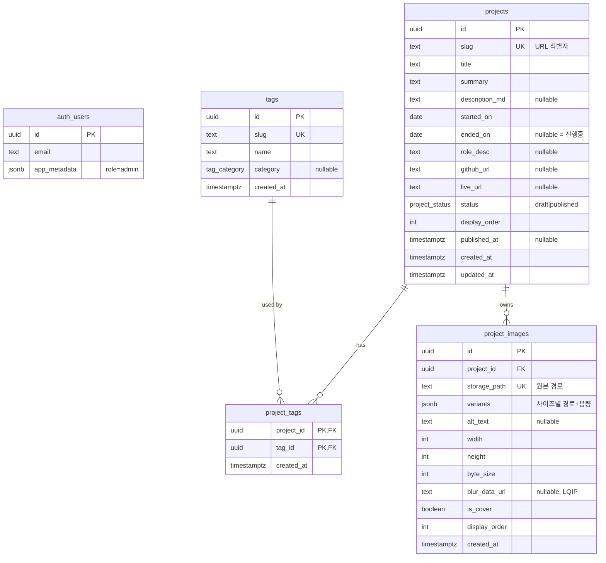

# 02. 데이터 모델 및 접근 정책

> 이 문서의 SQL은 **설계 명세**입니다. 실제 마이그레이션 파일은 스프린트 1에서 작성합니다.
> 여기서는 "무엇을, 왜 그렇게" 만들지를 확정합니다.

## 0. 설계 전제

- 권한 판별: **JWT `app_metadata.role` 클레임** (확정)
- 이미지: **업로드 시 사전 변환 → public 버킷 CDN 직접 서빙** (확정)
- 규모: 프로젝트 ~10개, 태그 ~30개, 이미지 ~50장
- 스키마 관리: 로컬 Supabase CLI + 마이그레이션 파일 버전 관리 (Flyway와 동일한 모델)

### 이 규모에서 정직하게 말해둘 것

프로젝트 10개, 이미지 50장은 **Postgres 입장에서는 사실상 빈 테이블**입니다.
따라서 이 문서의 인덱스 설계는 대부분 *성능*이 목적이 아니라 **제약 조건의 강제**와
**의도의 문서화**가 목적입니다. 이걸 구분하지 않고 "인덱스를 걸었으니 빠르다"고 쓰면
설계 문서로서 거짓말이 됩니다. 각 인덱스마다 목적을 명시했습니다.

---

## 1. 테이블 목록

| 테이블 | 역할 | 예상 행 수 | 비고 |
|---|---|---|---|
| `projects` | 프로젝트 본체 | ~10 | 공개/비공개 경계의 기준점 |
| `tags` | 기술 태그 마스터 | ~30 | |
| `project_tags` | 프로젝트↔태그 연결 | ~60 | 조인 테이블 |
| `project_images` | 이미지 메타데이터 | ~50 | 실제 파일은 Storage |
| `auth.users` | 계정 (Supabase 관리) | 1 | 직접 만들지 않음 |

**만들지 않는 테이블과 이유**

- `profiles` — 사용자가 1명이고 권한은 JWT 클레임으로 판별합니다. 만들면 모든 RLS 정책에
  `EXISTS (SELECT 1 FROM profiles ...)` 서브쿼리가 붙습니다.
- `project_views` — 2단계. MVP에 넣으면 공개 페이지에서 쓰기가 발생해 정적 렌더링이 깨집니다.
- `image_variants` — 변환 결과를 별도 테이블로 정규화하지 않고 `project_images.variants` (JSONB)에
  담습니다. 사유는 §3.4.

---

## 2. ERD



> `auth_users`는 Supabase가 관리하는 `auth.users`입니다. MVP에서는 **FK로도 참조하지 않습니다.**
> 작성자가 1명뿐이라 `created_by` 컬럼이 담을 정보가 없기 때문입니다.
> (2단계에서 다중 사용자가 되면 그때 추가합니다.)

---

## 3. 테이블 상세

### 3.0 공통 규약

| 규약 | 값 | 근거 |
|---|---|---|
| PK 타입 | `uuid` (`gen_random_uuid()`) | 순번 노출 방지(프로젝트 개수가 URL로 드러나지 않음), Storage 경로에 그대로 사용 가능, 클라이언트에서 미리 생성 가능 |
| 시각 타입 | `timestamptz` | Postgres에서 `timestamp`(타임존 없음)를 쓰면 배포 환경 타임존에 따라 값이 달라집니다. 예외 없이 `timestamptz` |
| 날짜 타입 | `date` | 프로젝트 기간은 "일" 단위면 충분. 시각까지 저장하면 표시할 때마다 타임존 변환 고민이 생김 |
| 문자열 | `text` | Postgres에서 `varchar(n)`은 `text` 대비 성능 이점이 없습니다. 길이 제한은 `CHECK`로 명시 |
| 감사 컬럼 | `created_at`, `updated_at` | `updated_at`은 트리거로 갱신 |
| 네이밍 | `snake_case`, 테이블은 복수형 | PostgREST가 컬럼명을 그대로 JSON 키로 노출하므로 일관성이 중요 |

**JPA와의 첫 번째 차이**: `@GeneratedValue(strategy = IDENTITY)`로 auto-increment를 쓰는 습관이 있다면
여기서는 버려야 합니다. UUID를 쓰는 이유는 정렬 성능이 아니라 **경로·URL·Storage 키를 하나의 식별자로 통일**하기
위함이고, 이 규모에서 UUID의 인덱스 단편화 단점은 무의미합니다.

---

### 3.1 `projects`

```sql
create type project_status as enum ('draft', 'published');

create table public.projects (
  id              uuid primary key default gen_random_uuid(),
  slug            text not null,
  title           text not null,
  summary         text not null,
  description_md  text,
  started_on      date not null,
  ended_on        date,
  role_desc       text,
  github_url      text,
  live_url        text,
  status          project_status not null default 'draft',
  display_order   integer not null default 0,
  published_at    timestamptz,
  created_at      timestamptz not null default now(),
  updated_at      timestamptz not null default now(),

  constraint projects_slug_key        unique (slug),
  constraint projects_slug_format     check (slug ~ '^[a-z0-9]+(-[a-z0-9]+)*$'),
  constraint projects_slug_len        check (char_length(slug) between 2 and 80),
  constraint projects_title_len       check (char_length(title) between 1 and 120),
  constraint projects_summary_len     check (char_length(summary) between 1 and 200),
  constraint projects_period_valid    check (ended_on is null or ended_on >= started_on),
  constraint projects_github_url_fmt  check (github_url is null or github_url ~ '^https://'),
  constraint projects_live_url_fmt    check (live_url  is null or live_url  ~ '^https://'),
  constraint projects_published_stamp check (
    (status = 'published' and published_at is not null)
    or (status = 'draft' and published_at is null)
  )
);
```

**컬럼 선택 근거**

- **`slug` (유니크, 형식 제약)** — URL 식별자입니다. 형식을 `CHECK`로 강제하는 이유는,
  애플리케이션의 slug 생성 로직에 버그가 생겨도 잘못된 값이 DB에 들어가지 못하게 하기 위함입니다.
  이런 게 "DB를 마지막 방어선으로 쓴다"는 것의 구체적 의미입니다.
- **`summary` 필수 + 200자 제한** — 목록 카드와 OG description에 동시에 쓰입니다.
  OG description 권장 길이가 대략 150~200자이므로(추측입니다 — 플랫폼마다 다름) 여기서 잘라둡니다.
- **`role_desc`** — `role`이 아니라 `role_desc`인 이유: `role`은 Postgres 예약어에 가깝고
  RLS 문맥에서 "DB 롤"과 헷갈립니다. 혼동 비용이 이름의 어색함보다 큽니다.
- **`ended_on` nullable = 진행 중** — 별도 `is_ongoing` 불리언을 두면
  `is_ongoing = true`인데 `ended_on`도 채워진 모순 상태가 가능해집니다. nullable 하나로 표현 가능한 걸
  두 컬럼으로 나누지 않습니다.
- **`status` ENUM vs boolean** — `is_published` 불리언이 더 단순하지만, 2단계에 `archived`
  (공개했다가 내린 것, 삭제는 아님)가 생길 가능성이 있습니다. ENUM은 값 추가가 쉽습니다.
  **JPA 대비 주의**: `@Enumerated(EnumType.STRING)`으로 문자열을 저장하는 것과 달리,
  Postgres ENUM은 **DB 레벨 타입**입니다. 값을 추가하려면 마이그레이션이 필요하고,
  중간 값 삽입이나 값 삭제는 번거롭습니다. 이 트레이드오프를 알고 선택합니다.
- **`published_at`** — `status`와 중복처럼 보이지만 용도가 다릅니다. 사이트맵의 `lastmod`,
  RSS, "최근 공개순" 정렬에 필요합니다. `CHECK` 제약으로 두 컬럼의 정합성을 강제했습니다.
- **`display_order`** — 포트폴리오는 "가장 보여주고 싶은 것"을 위에 두는 게 핵심입니다.
  날짜순 자동 정렬만으로는 부족합니다.

**의도적으로 넣지 않은 컬럼**

| 컬럼 | 이유 |
|---|---|
| `view_count` | 조회 시 쓰기가 발생 → 정적 렌더링 불가 (`01` §4) |
| `created_by` | 사용자 1명 |
| `deleted_at` | `draft`가 역할을 대신함 |
| `thumbnail_url` | `project_images.is_cover`로 도출. 두 곳에 저장하면 불일치 발생 |
| `tags` (배열 컬럼) | 태그를 `text[]`로 넣으면 조인 테이블이 필요 없어 단순하지만, 태그 이름 수정 시 전 행을 갱신해야 하고 오타 방지가 불가능합니다 |

**인덱스**

```sql
-- (1) 제약 목적: slug 유일성 (unique constraint가 자동 생성)
--     → projects_slug_key

-- (2) 성능 + 의도 문서화: 공개 목록 조회 경로
create index projects_published_order_idx
  on public.projects (display_order asc, started_on desc)
  where status = 'published';
```

> **부분 인덱스(`where status = 'published'`)를 쓴 이유**
> 공개 목록 쿼리는 항상 `status = 'published'` 조건을 포함합니다(RLS가 자동으로 붙입니다).
> 부분 인덱스는 인덱스 크기를 줄이는 동시에 **"이 테이블의 지배적 접근 경로가 무엇인지"** 를
> 스키마에 기록합니다. 10행 규모에서 Postgres는 어차피 Seq Scan을 선택하겠지만,
> 6개월 뒤 이 스키마를 다시 볼 때 이 한 줄이 설계 의도를 알려줍니다.
> **성능 효과는 현재 규모에서 사실상 0입니다** — 이걸 성능 최적화라고 부르지 않겠습니다.

---

### 3.2 `tags`

```sql
create type tag_category as enum ('language', 'framework', 'infra', 'tool', 'etc');

create table public.tags (
  id         uuid primary key default gen_random_uuid(),
  slug       text not null,
  name       text not null,
  category   tag_category not null default 'etc',
  created_at timestamptz not null default now(),

  constraint tags_slug_key    unique (slug),
  constraint tags_slug_format check (slug ~ '^[a-z0-9]+(-[a-z0-9]+)*$'),
  constraint tags_name_len    check (char_length(name) between 1 and 40)
);
```

- **`slug`와 `name`을 분리한 이유** — 표시명은 `Next.js`, URL과 비교용 키는 `nextjs`입니다.
  하나로 합치면 URL에 점(.)과 대문자가 섞이고, `NextJS` / `Next.js` / `next.js`가
  서로 다른 태그로 쌓입니다. slug 유니크 제약이 **오타 태그 중복을 DB 레벨에서 막습니다.**
- **`category`** — 필터 UI에서 언어/프레임워크/인프라를 그룹으로 묶어 보여줄 수 있습니다.
  기본값을 `'etc'`로 두어 분류를 강요하지 않습니다.

**인덱스**: `tags_slug_key`(유니크 제약 자동 생성) 외에 없음.
30행 테이블에 추가 인덱스를 만드는 것은 순수한 낭비입니다.

---

### 3.3 `project_tags`

```sql
create table public.project_tags (
  project_id uuid not null references public.projects(id) on delete cascade,
  tag_id     uuid not null references public.tags(id)     on delete cascade,
  created_at timestamptz not null default now(),

  constraint project_tags_pkey primary key (project_id, tag_id)
);

-- 역방향 조회 경로: "이 태그가 달린 프로젝트들"
create index project_tags_tag_id_idx on public.project_tags (tag_id);
```

**설계 근거**

- **복합 PK vs 대리키(`id uuid`)** — 조인 테이블에 별도 `id`를 두지 않았습니다.
  복합 PK가 **"같은 태그를 같은 프로젝트에 두 번 달 수 없다"** 를 DB가 강제하게 만듭니다.
  대리키를 두면 이 제약을 별도 유니크 인덱스로 또 만들어야 합니다.
  > **JPA 대비**: `@ManyToMany` + `@JoinTable`로 처리하던 것을 여기서는 **명시적 엔티티**로 만듭니다.
  > 사실 JPA에서도 `@ManyToMany`보다 조인 엔티티를 명시하는 편이 낫다는 게 통설이고,
  > 여기서는 선택의 여지 없이 그렇게 됩니다. `created_at` 같은 관계 자체의 속성을 담을 수 있는 것도 이점입니다.

- **`project_tags_tag_id_idx`가 필요한 이유** — 복합 PK `(project_id, tag_id)`의 인덱스는
  **선두 컬럼이 `project_id`** 라서 "특정 태그로 프로젝트 찾기" 쿼리에는 쓰이지 않습니다.
  이건 복합 인덱스의 leftmost prefix 규칙으로, MySQL/Oracle에서 겪던 것과 동일합니다.
  현재 규모에서 성능 차이는 없지만, **RLS 정책이 이 방향으로 조인을 걸기 때문에** 명시해 둡니다.

- **`on delete cascade`** — 프로젝트나 태그가 지워지면 연결도 사라집니다.
  > **JPA 대비 중요**: `@OneToMany(cascade = CascadeType.REMOVE)`는 **JPA(영속성 컨텍스트) 레벨**의
  > 동작이라 JPQL 벌크 삭제나 네이티브 쿼리로 지우면 동작하지 않습니다.
  > 여기의 `ON DELETE CASCADE`는 **DB 레벨**이라 어떤 경로로 삭제해도 항상 적용됩니다.
  > 더 안전하지만, 동시에 **더 위험합니다** — 실수로 태그 하나를 지우면 모든 연결이 조용히 사라집니다.

---

### 3.4 `project_images`

```sql
create table public.project_images (
  id            uuid primary key default gen_random_uuid(),
  project_id    uuid not null references public.projects(id) on delete cascade,
  storage_path  text not null,
  variants      jsonb not null default '{}'::jsonb,
  alt_text      text,
  width         integer not null,
  height        integer not null,
  byte_size     integer not null,
  blur_data_url text,
  is_cover      boolean not null default false,
  display_order integer not null default 0,
  created_at    timestamptz not null default now(),

  constraint project_images_storage_path_key unique (storage_path),
  constraint project_images_dimensions       check (width > 0 and height > 0),
  constraint project_images_size_limit       check (byte_size between 1 and 10485760),
  constraint project_images_alt_len          check (alt_text is null or char_length(alt_text) <= 200),
  constraint project_images_variants_object  check (jsonb_typeof(variants) = 'object')
);

-- 프로젝트당 대표 이미지는 최대 1개 (부분 유니크 인덱스)
create unique index project_images_one_cover_idx
  on public.project_images (project_id)
  where is_cover;

-- 갤러리 정렬 조회 경로
create index project_images_project_order_idx
  on public.project_images (project_id, display_order asc);
```

**핵심 설계 결정 3가지**

**(1) 대표 이미지를 `projects.cover_image_id` FK가 아니라 `project_images.is_cover`로 둔 이유**

`projects` → `project_images` → `projects`의 **순환 FK**가 생기면 삽입 순서가 꼬입니다.
(프로젝트를 먼저 만들어야 이미지를 넣는데, 프로젝트에 대표 이미지 FK가 NOT NULL이면 넣을 수가 없음)
`is_cover` + **부분 유니크 인덱스**가 순환 없이 "최대 1개" 제약을 DB에서 강제합니다.

> 이건 JPA에서 자주 겪는 `@OneToOne` 양방향 순환 문제와 같은 상황인데,
> 해법이 다릅니다. Postgres의 부분 인덱스(`WHERE` 절이 붙은 유니크 인덱스)는
> JPA/JPQL에 대응 개념이 없습니다 — DDL로만 표현되는 제약입니다.

**주의점**: 대표 이미지를 바꿀 때 "기존 것 해제 → 새 것 지정" 두 문장 사이에 유니크 위반이 날 수 있습니다.
같은 트랜잭션 안에서 처리하거나, 인덱스를 `DEFERRABLE`로 둘 수 없으므로(유니크 **인덱스**는
`DEFERRABLE` 불가) **UPDATE 순서를 보장하는 RPC 함수**로 처리해야 합니다. → §7 원자적 쓰기

**(2) `variants`를 JSONB로 둔 이유**

사전 변환 전략상 이미지 1장이 여러 파일(썸네일/중간/큰 것)을 만듭니다. 정규화한다면
`image_variants` 테이블이 되겠지만:

- variant 종류는 애플리케이션이 정하는 **고정된 소수의 집합**이고 개별 조회 대상이 아닙니다
- 항상 부모 이미지와 함께 통째로 읽힙니다 (JOIN이 순수 오버헤드)
- 테이블을 늘리면 RLS 정책도 하나 더 늘어납니다 — 그게 진짜 비용입니다

예상 구조 (애플리케이션 계약으로 문서화, DB는 검증하지 않음):

```jsonc
{
  "thumb": { "path": "…/abc_400.webp",  "w": 400,  "h": 250, "bytes": 21504 },
  "md":    { "path": "…/abc_800.webp",  "w": 800,  "h": 500, "bytes": 68000 },
  "lg":    { "path": "…/abc_1600.webp", "w": 1600, "h": 1000, "bytes": 210000 }
}
```

**트레이드오프를 명시합니다**: JSONB는 스키마 검증을 받지 못합니다. 오타 난 키가 들어가도 DB는 통과시킵니다.
이 위험을 감수하는 대신, 생성된 타입 위에 **애플리케이션 레벨 스키마 검증**을 두어 경계에서 막습니다.
정규화 대비 안전성이 낮다는 걸 알고 선택하는 것입니다.
(2단계에서 variant 종류가 늘거나 개별 관리가 필요해지면 테이블로 승격 — 마이그레이션 비용은 낮습니다.)

**(3) `blur_data_url`**

업로드 시 만든 아주 작은(20px 내외) base64 이미지입니다. 로딩 중 자리표시자로 씁니다.
`next/image`의 최적화를 끄고 쓰기 때문에(사전 변환 전략) 자동 blur placeholder를 못 받습니다.
그 공백을 여기서 메웁니다. 행당 수백 바이트라 DB 용량에 미치는 영향은 무시할 수준입니다.

---

## 4. 트리거

```sql
create or replace function public.set_updated_at()
returns trigger
language plpgsql
as $$
begin
  new.updated_at = now();
  return new;
end;
$$;

create trigger projects_set_updated_at
  before update on public.projects
  for each row execute function public.set_updated_at();
```

> **JPA 대비**: `@PreUpdate` / `@LastModifiedDate`(Spring Data Auditing)에 대응합니다.
> 차이는 **적용 범위**입니다. JPA 콜백은 JPA를 거친 변경에만 동작하지만,
> DB 트리거는 Supabase 대시보드에서 직접 수정하든 psql로 UPDATE를 날리든 항상 동작합니다.
> 1인 운영에서 대시보드 직접 수정은 실제로 자주 일어납니다 — 그래서 트리거가 맞습니다.

---

## 5. RLS (Row Level Security)

**이 절이 이 문서에서 가장 중요합니다.** 아키텍처 원칙의 1번 요구사항이 여기서 실현됩니다.

### 5.0 왜 애플리케이션 코드가 아니라 DB인가

Spring에서라면 `ProjectService.findPublicProjects()`에 `WHERE status = 'PUBLISHED'`를 넣고
`@PreAuthorize("hasRole('ADMIN')")`로 관리 API를 막았을 겁니다. 그 방식은 **모든 데이터 접근이
반드시 애플리케이션 서버를 거친다**는 전제 위에서만 안전합니다.

Supabase에서는 그 전제가 성립하지 않습니다. **브라우저가 익명 키(anon key)로 PostgREST에
직접 요청할 수 있고, 익명 키는 프론트엔드 번들에 그대로 들어갑니다.** 즉 누구나
`GET /rest/v1/projects?select=*` 를 직접 호출할 수 있습니다.

따라서 여기서 필터링 조건을 애플리케이션에만 두면 **`draft` 프로젝트가 그대로 노출됩니다.**
RLS는 "있으면 좋은 심화 기능"이 아니라 **이 아키텍처에서 유일하게 유효한 접근 제어 수단**입니다.

> 정신 모델: RLS는 Spring Security의 `@PreAuthorize`가 아니라,
> **모든 쿼리에 자동으로 AND 조건이 붙는 Hibernate `@Where`/`@Filter`** 에 더 가깝습니다.
> 다만 우회가 불가능하다는 점이 결정적으로 다릅니다.

### 5.1 롤 구조

| Postgres 롤 | 사용 주체 | RLS 적용 |
|---|---|---|
| `anon` | 로그인하지 않은 방문자 | ✅ 적용 |
| `authenticated` | 로그인한 사용자 (= 나) | ✅ 적용 |
| `service_role` | 서버 전용 비밀 키 | ❌ **RLS 우회** |

**`service_role` 키는 이 프로젝트에서 원칙적으로 사용하지 않습니다.**
사용해야 할 곳이 생기면 그것 자체가 설계 오류 신호입니다.
(예외: 백업 스크립트 — 하지만 그건 앱 런타임이 아니라 CI에서 도는 별개 경로입니다.)
이 키가 클라이언트 번들에 들어가면 RLS 전체가 무의미해집니다.
→ 환경변수 이름에 `NEXT_PUBLIC_` 접두사가 붙지 않도록 반드시 확인. (`03` §4 참조)

### 5.2 권한 판별 함수

```sql
create or replace function public.is_admin()
returns boolean
language sql
stable
security definer
set search_path = ''
as $$
  select coalesce(
    (auth.jwt() -> 'app_metadata' ->> 'role') = 'admin',
    false
  );
$$;
```

**설계 포인트**

- **`app_metadata`를 쓰고 `user_metadata`를 쓰지 않는 이유** — `user_metadata`는
  **사용자가 스스로 수정할 수 있습니다.** 거기에 `role`을 넣으면 누구나 자기를 관리자로 승격시킬 수 있습니다.
  `app_metadata`는 `service_role` 권한으로만 변경 가능합니다. **이 구분을 틀리면 인증 체계가 통째로 무너집니다.**
- **`stable`** — 같은 문장 안에서 결과가 변하지 않음을 Postgres에 알려 반복 평가를 줄입니다.
- **`set search_path = ''`** — `security definer` 함수의 스키마 하이재킹을 막는 표준 방어입니다.
- **`coalesce(..., false)`** — JWT가 없거나 클레임이 없으면 `NULL`이 되고,
  RLS에서 `NULL`은 "거부"로 취급되긴 하지만 **명시적으로 `false`를 반환하도록** 해서
  정책을 읽을 때 3값 논리를 고민하지 않게 합니다.

**클레임 부여 방법**: Supabase 대시보드 또는 Admin API로 해당 사용자에게 1회 설정.
자동화하지 않습니다(계정이 1개이므로). 설정 절차는 `05` 스프린트 1의 DoD에 포함합니다.

**알아둘 제약**: `app_metadata` 변경은 **기존에 발급된 JWT에 즉시 반영되지 않습니다.**
토큰이 갱신되어야 반영됩니다. 클레임을 부여한 뒤 로그아웃 → 재로그인이 필요합니다.
(스프린트 1에서 "왜 관리자 권한이 안 먹지?" 로 헤맬 지점이라 미리 적어둡니다.)

### 5.3 GRANT (2026-05-30 이후 생성 프로젝트 필수)

RLS 정책만으로는 부족합니다. **GRANT와 RLS는 별개의 층**입니다.

- **GRANT** = "이 롤이 이 테이블에 접근할 수 있는가" (테이블 단위, 전통적 Postgres 권한)
- **RLS** = "접근할 수 있다면, 어떤 *행*까지인가" (행 단위)

GRANT가 없으면 RLS 정책이 아무리 허용적이어도 `permission denied for table ...`이 납니다.
2026년 5월 30일 이후 생성된 Supabase 프로젝트는 이 GRANT가 기본 부여되지 않으므로
**마이그레이션에 명시적으로 포함해야 합니다.**

```sql
-- 스키마 사용 권한
grant usage on schema public to anon, authenticated;

-- 공개 읽기 대상
grant select on public.projects       to anon, authenticated;
grant select on public.tags           to anon, authenticated;
grant select on public.project_tags   to anon, authenticated;
grant select on public.project_images to anon, authenticated;

-- 쓰기는 로그인 사용자에게만 (실제 허용 여부는 RLS가 다시 판단)
grant insert, update, delete on public.projects       to authenticated;
grant insert, update, delete on public.tags           to authenticated;
grant insert, update, delete on public.project_tags   to authenticated;
grant insert, update, delete on public.project_images to authenticated;

-- anon에게는 쓰기 권한을 절대 부여하지 않음
```

> **`anon`에게 `select`를 주면서도 `draft`가 안 보이는 이유**가 바로 RLS입니다.
> GRANT는 문을 열고, RLS는 방을 고릅니다. 두 개를 같이 봐야 그림이 완성됩니다.
>
> **주의**: `authenticated`에게 `update`를 GRANT했지만, 실제로 관리자가 아닌 로그인 사용자는
> RLS에서 막힙니다. 계정이 1개인 지금은 차이가 없지만, 2단계에서 사용자가 늘면
> 이 두 층이 함께 작동하는 구조가 중요해집니다.

### 5.4 `projects` 정책

```sql
alter table public.projects enable row level security;
alter table public.projects force row level security;

-- 읽기: 공개된 것은 누구나 / 관리자는 전부
create policy projects_select_public
  on public.projects for select
  to anon, authenticated
  using (status = 'published' or public.is_admin());

-- 삽입: 관리자만
create policy projects_insert_admin
  on public.projects for insert
  to authenticated
  with check (public.is_admin());

-- 수정: 관리자만 (기존 행 접근 + 변경 후 값 모두 검사)
create policy projects_update_admin
  on public.projects for update
  to authenticated
  using (public.is_admin())
  with check (public.is_admin());

-- 삭제: 관리자만
create policy projects_delete_admin
  on public.projects for delete
  to authenticated
  using (public.is_admin());
```

**읽어야 할 포인트**

- **`force row level security`** — 이게 없으면 **테이블 소유자는 RLS를 우회합니다.**
  마이그레이션을 실행한 롤이 소유자가 되므로, 없으면 정책을 테스트할 때
  "왜 다 보이지?" 하고 착각하게 됩니다. 반드시 포함합니다.
- **`using` vs `with check`** — `using`은 *읽을/건드릴 수 있는 기존 행*을,
  `with check`는 *쓰기 후 결과 행이 만족해야 할 조건*을 봅니다.
  UPDATE에는 둘 다 필요합니다. 하나만 쓰면 "볼 수는 있지만 남의 행으로 바꿔버리는" 구멍이 생깁니다.
  (지금은 관리자 단일이라 실질 차이가 없지만, 습관을 여기서 들이는 게 맞습니다.)
- **정책은 OR로 합쳐집니다** — 같은 명령(`select`)에 정책이 여러 개면 하나라도 통과하면 허용입니다.
  그래서 읽기 정책 하나에 `or public.is_admin()`을 넣었습니다. 정책을 두 개로 나눠도 결과는 같습니다.
- **`to anon, authenticated` 명시** — 롤을 생략하면 `public`(모든 롤)에 적용됩니다.
  명시하는 편이 의도가 드러납니다.

### 5.5 `project_images` 정책 — **여기가 함정입니다**

```sql
alter table public.project_images enable row level security;
alter table public.project_images force row level security;

create policy project_images_select_public
  on public.project_images for select
  to anon, authenticated
  using (
    public.is_admin()
    or exists (
      select 1 from public.projects p
      where p.id = project_images.project_id
        and p.status = 'published'
    )
  );

create policy project_images_write_admin
  on public.project_images for all
  to authenticated
  using (public.is_admin())
  with check (public.is_admin());
```

> **왜 함정인가**
> `projects`에만 RLS를 걸고 자식 테이블을 방치하는 것이 이 구조에서 가장 흔한 사고입니다.
> `project_images`가 무방비면, 익명 사용자가 이 테이블을 직접 조회해서
> **비공개 프로젝트의 이미지 경로 전체를 가져갈 수 있습니다.** 그 경로는 public 버킷을 가리키므로
> 곧바로 이미지를 볼 수 있습니다. `projects`가 아무리 잘 막혀 있어도 소용없습니다.
>
> **원칙: 부모의 공개 상태를 참조하는 모든 자식 테이블은 각자 EXISTS 검사를 가져야 한다.**
> 새 테이블을 추가할 때마다 이 질문을 반복해야 합니다.

### 5.6 `project_tags` 정책

```sql
alter table public.project_tags enable row level security;
alter table public.project_tags force row level security;

create policy project_tags_select_public
  on public.project_tags for select
  to anon, authenticated
  using (
    public.is_admin()
    or exists (
      select 1 from public.projects p
      where p.id = project_tags.project_id
        and p.status = 'published'
    )
  );

create policy project_tags_write_admin
  on public.project_tags for all
  to authenticated
  using (public.is_admin())
  with check (public.is_admin());
```

§5.5와 동일한 논리입니다. 이게 없으면 "비공개 프로젝트가 어떤 기술을 쓰는지"가 새어 나갑니다.
민감도는 이미지보다 낮지만, 일관성이 없는 정책은 유지보수 중에 반드시 실수를 부릅니다.

### 5.7 `tags` 정책

```sql
alter table public.tags enable row level security;
alter table public.tags force row level security;

create policy tags_select_public
  on public.tags for select
  to anon, authenticated
  using (true);

create policy tags_write_admin
  on public.tags for all
  to authenticated
  using (public.is_admin())
  with check (public.is_admin());
```

**`using (true)`로 전체 공개한 트레이드오프를 명시합니다.**
비공개 프로젝트에만 달린 태그도 목록에 노출됩니다. 예를 들어 아직 공개 안 한 프로젝트에
`Kubernetes` 태그를 달아두면, 방문자는 "이 사람이 뭔가 쿠버네티스 관련 작업을 하고 있다"를
추론할 수 있습니다.

- **영향**: 미미합니다. 태그 이름 자체에 기밀이 없습니다.
- **대안**: `EXISTS (… published 프로젝트에 연결된 태그만 …)` 로 좁힐 수 있습니다.
  다만 그러면 관리 화면의 태그 자동완성이 공개된 태그만 보여주게 되어 별도 처리가 필요합니다.
- **권고**: MVP는 `using (true)`. 신경 쓰이면 §8 Q2에서 결정.

### 5.8 RLS 정책 요약표

| 테이블 | anon SELECT | anon 쓰기 | admin |
|---|---|---|---|
| `projects` | `status='published'` | ❌ | 전체 |
| `project_images` | 부모가 published | ❌ | 전체 |
| `project_tags` | 부모가 published | ❌ | 전체 |
| `tags` | 전체 | ❌ | 전체 |

### 5.9 RLS 검증 방법 (스프린트 1 DoD)

정책은 **작성했다고 되는 게 아니라 검증해야 됩니다.** 다음을 실제로 확인합니다.

1. `draft` 프로젝트를 1건 만들어 둔다
2. 익명 키만으로 `projects`를 조회 → 해당 행이 **없어야** 함
3. 익명 키로 `project_images`를 필터 없이 전체 조회 → 그 프로젝트의 이미지가 **없어야** 함
4. 익명 키로 `project_tags` 전체 조회 → 해당 연결이 **없어야** 함
5. 익명 키로 `projects`에 INSERT 시도 → **실패해야** 함
6. `draft` 프로젝트의 slug로 상세 URL 접근 → **404**
7. 관리자로 로그인 후 1~4 반복 → **전부 보여야** 함

> 3번과 4번을 빠뜨리기 쉽습니다. §5.5의 함정이 정확히 여기서 잡힙니다.

---

## 6. Storage 설계

### 6.1 버킷 구성

| 버킷 | 공개 여부 | 용도 | 예상 용량 |
|---|---|---|---|
| `project-images` | **public** | 사전 변환된 WebP variant. CDN 직접 서빙 | ~20 MB |
| `project-originals` | **private** | 업로드 원본 보관 (재변환 대비) | ~150 MB |

**왜 두 개로 나누는가**

- variant는 방문자에게 서빙되어야 하므로 public이어야 합니다.
  public 버킷은 CDN 캐시가 걸리고 서명 URL 생성 비용이 없습니다 → 함수 호출 절감.
- 원본은 서빙 대상이 아닙니다. 용량이 크고(장당 수 MB), 노출할 이유가 없습니다.
  private으로 두면 유출 위험이 없고 egress도 발생하지 않습니다.
- 나중에 "화질을 다시 뽑고 싶다"거나 "AVIF로 갈아탄다"가 되면 원본이 반드시 필요합니다.
  원본 없이 variant만 남기면 되돌릴 수 없습니다. 1GB 한도 안에서 감당 가능하므로 보관합니다.

### 6.2 경로 규칙

```
project-images/     {projectId}/{imageId}_{width}.webp
project-originals/  {projectId}/{imageId}.{ext}
```

- **추측 불가능한 경로**: `imageId`가 UUID이므로 URL을 모르면 접근할 수 없습니다.
- **프로젝트 단위 접두사**: 프로젝트 삭제 시 접두사로 일괄 정리가 가능합니다.
- **경로에 파일명 원본을 쓰지 않는 이유**: 한글/공백/특수문자 인코딩 문제와
  파일명 충돌을 원천 차단합니다.

### 6.3 Storage 접근 정책

Storage도 결국 `storage.objects` 테이블에 대한 RLS입니다.

```sql
-- 업로드/수정/삭제: 관리자만 (두 버킷 공통)
create policy storage_write_admin
  on storage.objects for all
  to authenticated
  using (
    bucket_id in ('project-images', 'project-originals')
    and public.is_admin()
  )
  with check (
    bucket_id in ('project-images', 'project-originals')
    and public.is_admin()
  );

-- private 버킷 읽기: 관리자만
create policy storage_read_originals_admin
  on storage.objects for select
  to authenticated
  using (bucket_id = 'project-originals' and public.is_admin());

-- public 버킷(project-images)의 읽기는 버킷의 public 설정으로 처리됨
```

### 6.4 **정면으로 인정해야 할 보안 한계**

**public 버킷에 올라간 이미지는 RLS의 보호를 받지 않습니다.**
버킷을 public으로 만든다는 것은 "경로를 아는 사람은 누구나 읽을 수 있다"는 뜻입니다.

즉 **`draft` 프로젝트의 이미지도, 경로를 알면 볼 수 있습니다.**

- **실제 위험도**: 낮습니다. 경로는 UUID 두 개의 조합이라 추측이 불가능하고,
  DB 쪽 RLS(§5.5)가 경로 자체의 유출을 막고 있습니다. 남는 공격 경로는
  "내가 실수로 URL을 어딘가에 붙여넣는 것" 정도입니다.
- **하지만 이건 security by obscurity입니다.** 방어라고 부르면 안 됩니다.
- **완화안 A (권고)**: MVP에서는 현 구조를 유지하되, 이 한계를 문서화하고
  `draft` 상태에서 관리자 미리보기를 할 때 외부에 URL을 공유하지 않는다는 운영 규칙을 둡니다.
- **완화안 B**: `draft` 이미지를 private 버킷에 두고 `published` 전환 시 public 버킷으로
  이동(copy + delete)합니다. 완전하지만, 상태 전환 로직이 DB 트랜잭션과 Storage 작업에
  걸쳐 있어 **부분 실패 처리**가 필요합니다(Storage는 트랜잭션에 참여하지 않음).
  MVP 복잡도로는 과합니다.
- **결정 필요** → §8 Q1

### 6.5 캐시 설정

업로드 시 `cacheControl`을 명시적으로 설정합니다.

- 기본값은 3600초(1시간)로 알고 있습니다(추측입니다 — 실제 값은 스프린트 3에서 확인).
- 경로가 불변(UUID + 사이즈)이므로 **`max-age=31536000, immutable`** 로 설정합니다.
- 효과: CDN 재검증 요청이 사라져 **Supabase egress 5GB 한도 소진이 크게 늦춰집니다.**
  이미지를 바꿔야 하면 새 UUID로 새 파일을 올립니다(캐시 무효화 대신 경로 교체).

---

## 7. 원자적 쓰기 (RPC)

**이 절은 Spring/JPA 배경에서 가장 크게 어긋나는 지점입니다.**

프로젝트 저장은 논리적으로 하나의 작업이지만 물리적으로는 여러 테이블을 건드립니다.

1. `projects` UPDATE
2. `project_tags` 기존 연결 DELETE
3. `project_tags` 새 연결 INSERT
4. `project_images` 대표 이미지 재지정

Spring이라면 `@Transactional` 하나로 끝날 일입니다.
**PostgREST에서는 HTTP 요청 1건 = 트랜잭션 1개입니다.** 위를 4번의 호출로 나누면
4개의 독립 트랜잭션이 되고, 2번과 3번 사이에서 실패하면 **태그가 전부 사라진 상태로 남습니다.**

### 해법: Postgres 함수(RPC)

```sql
create or replace function public.save_project_with_tags(
  p_project_id uuid,
  p_tag_ids    uuid[]
)
returns void
language plpgsql
security invoker   -- 호출자 권한 유지 → RLS가 그대로 적용됨
set search_path = public
as $$
begin
  if not public.is_admin() then
    raise exception 'forbidden';
  end if;

  delete from public.project_tags where project_id = p_project_id;

  insert into public.project_tags (project_id, tag_id)
  select p_project_id, unnest(p_tag_ids)
  on conflict do nothing;
end;
$$;
```

**중요한 선택: `security invoker`**

`security definer`로 만들면 함수가 소유자 권한으로 실행되어 **RLS를 우회**합니다.
그러면 정책을 아무리 잘 짜도 이 함수가 뒷문이 됩니다.
`security invoker`는 호출자 권한을 유지하므로 RLS가 그대로 적용됩니다.
**함수 안에서도 권한 검사를 한 번 더 하는 것**(`if not is_admin() then raise`)은
RLS가 조용히 0건을 처리하고 성공을 반환하는 상황을 막아 오류를 명확하게 만듭니다.

> 정신 모델: **RPC ≈ Spring의 `@Transactional` 서비스 메서드**입니다.
> 다만 코드가 Java가 아니라 PL/pgSQL로 DB 안에 살고, 버전 관리는 마이그레이션 파일로 합니다.
> 그래서 **RPC를 남발하면 안 됩니다** — 비즈니스 로직이 두 언어로 흩어집니다.
> **원자성이 실제로 필요한 곳에만** 씁니다. MVP에서 필요한 것은 위의 태그 동기화와
> 대표 이미지 전환 정도입니다.

---

## 8. JPA 엔티티 설계와 다른 점 (정리)

| # | JPA / Spring | Supabase / Postgres | 실무적 함의 |
|---|---|---|---|
| 1 | **스키마 소스**: 엔티티 클래스 (`ddl-auto`로 DDL 생성 가능) | **DB가 소스**. 마이그레이션 SQL → 타입 생성 (역방향) | 방향이 반대입니다. 타입 파일을 손으로 고치면 안 됩니다. 고쳐야 할 것은 항상 마이그레이션 SQL |
| 2 | **권한**: `@PreAuthorize`, `SecurityFilterChain` (앱 레이어) | **RLS** (DB 레이어) | 클라이언트가 DB에 직접 붙으므로 앱 레이어 권한 검사는 우회 가능. RLS만이 실효 |
| 3 | **트랜잭션**: `@Transactional`로 서비스 메서드 전체 | HTTP 요청 1건 = 트랜잭션 1개 | 다중 테이블 원자성이 필요하면 **RPC 함수**로 내려야 함 (§7) |
| 4 | **지연 로딩**: `FetchType.LAZY`, 프록시, N+1 문제 | 프록시 없음. `select=*,tags(*)`는 **서버가 만든 조인/서브쿼리** | N+1이 구조적으로 발생하지 않음. 대신 "무심코 다 가져오기"가 쉬움 → `select`에 필요한 컬럼만 명시 |
| 5 | **cascade**: `CascadeType.REMOVE` (영속성 컨텍스트 한정) | `ON DELETE CASCADE` (DB 레벨, 우회 불가) | 더 확실하지만 더 위험. 대시보드에서 행 하나 지우면 연쇄 삭제가 조용히 실행됨 |
| 6 | **낙관적 락**: `@Version` | 없음 (도입하지 않음) | 작성자 1명이라 불필요. 다중 사용자가 되면 반드시 재검토 |
| 7 | **감사**: `@CreatedDate`, `@LastModifiedDate` | DB 트리거 | 트리거는 앱을 거치지 않는 변경에도 동작 |
| 8 | **ENUM**: `@Enumerated(STRING)` = DB에는 varchar | Postgres ENUM = **DB 타입** | 값 추가에 마이그레이션 필요. 값 삭제/재정렬은 매우 번거로움 |
| 9 | **복합 키**: `@EmbeddedId` / `@IdClass` (보일러플레이트 다수) | `primary key (a, b)` 한 줄 | 조인 테이블 설계가 훨씬 가벼움 |
| 10 | **부분 인덱스** | `create unique index … where …` | JPA에 대응 개념 없음. "조건부 유일성"을 DB에서 강제할 수 있음 (§3.4의 대표 이미지) |
| 11 | **`@Where` / `@Filter`** | RLS | 개념은 비슷하나 RLS는 앱이 끌 수 없음 |
| 12 | **DTO 매핑**: 엔티티 → DTO 수동/MapStruct | 쿼리의 `select`가 곧 응답 형태 | 계층이 하나 줄지만, 응답 형태가 쿼리에 흩어지기 쉬움 → 데이터 접근 계층에 가둘 것 (`03` §5) |
| 13 | **연결 관리**: 커넥션 풀 (HikariCP) | PostgREST가 HTTP로 추상화 | 서버리스에서 커넥션 고갈 걱정이 없음. 이게 Supabase를 쓰는 실질적 이점 중 하나 |
| 14 | **`null` 처리** | `NULL`은 3값 논리. RLS 조건에서 `NULL`은 통과 실패 | `coalesce`로 명시적 `false`를 반환하는 습관 (§5.2) |

---

## 9. 타입 생성 전략

Supabase CLI가 스키마에서 TypeScript 타입을 생성합니다.

- **생성물은 커밋합니다.** 빌드 시점에 DB 접속이 필요해지면 CI가 DB 상태에 의존하게 되고,
  일시정지된 DB 때문에 배포가 실패할 수 있습니다.
- **생성 시점**: 마이그레이션을 적용한 직후. 로컬에서 생성 → 커밋.
- **CI 검증**: 마이그레이션 적용 후 타입을 재생성하여 **diff가 있으면 실패**시킵니다.
  이게 "단일 소스"를 강제하는 실질적 장치입니다. 없으면 타입과 스키마가 조용히 갈라집니다.
- **파생 타입**: 생성된 `Database` 타입에서 필요한 형태를 유도해서 씁니다.
  손으로 인터페이스를 다시 선언하면 단일 소스 원칙이 깨집니다.

> **JPA 대비**: 엔티티 클래스가 하던 "스키마의 코드 표현" 역할을 생성된 타입 파일이 합니다.
> 차이는 **사람이 편집하지 않는다**는 점입니다. 엔티티에 비즈니스 메서드를 넣던 습관은
> 여기서 쓸 수 없습니다 — 도메인 로직은 별도 모듈에 둡니다 (`03` §5).

---

## 10. 결정이 필요한 항목

- **Q1. `draft` 프로젝트 이미지의 public 버킷 노출(§6.4)을 감수할까요?**
  (a) 감수 + 운영 규칙으로 보완 (MVP 권고)
  (b) private/public 2버킷 + 게시 시 이동 — 안전하지만 부분 실패 처리 필요
  포트폴리오 이미지의 민감도를 감안하면 (a)가 합리적이라고 봅니다.

- **Q2. `tags`를 전체 공개(§5.7)로 둘까요, 공개 프로젝트에 연결된 것만 노출할까요?**
  전체 공개가 단순합니다. 미공개 작업의 기술 스택이 드러나는 게 신경 쓰이면 좁힙니다.

- **Q3. `description_md`의 길이 상한을 둘까요?**
  DB 500MB 대비 무시할 용량이라 기술적으로는 불필요하지만, 상한이 없으면
  실수로 거대한 텍스트를 붙여넣었을 때 정적 페이지가 비대해집니다. 권고: 50,000자 `CHECK`.

- **Q4. 프로젝트 기간을 `started_on`/`ended_on` 두 컬럼 대신 Postgres `daterange` 타입으로 둘까요?**
  `daterange`는 겹침 검사 등에 강력하지만 이 도메인에서는 쓸 일이 없고,
  생성 타입과 폼 처리가 번거로워집니다. **권고: 현재 설계(두 컬럼) 유지.**
  (선택지로만 남깁니다 — 답변 불필요하면 넘어가셔도 됩니다.)

- **Q5. 태그의 `category` ENUM 값 목록(`language`/`framework`/`infra`/`tool`/`etc`)이 적절합니까?**
  Postgres ENUM은 나중에 값을 바꾸기 번거로우므로 지금 확정하는 게 좋습니다.
  대안: `category`를 `text` + `CHECK`로 두면 변경이 쉬워집니다(제약은 약해짐).
