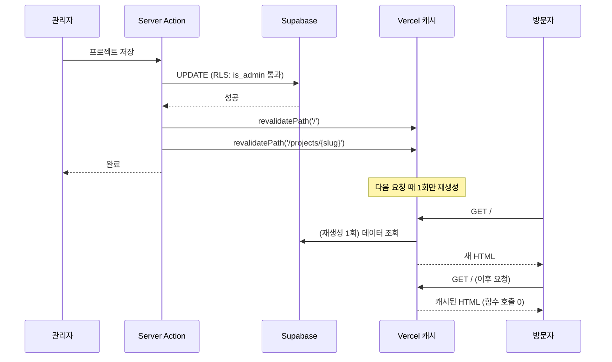
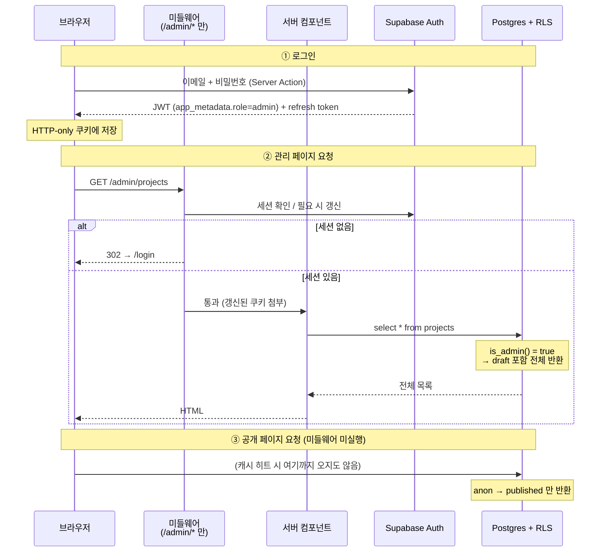

# 03. 아키텍처

> 설계 문서입니다. 코드 블록은 **구조 설명용 스케치**이며 구현 산출물이 아닙니다.

## 0. 아키텍처를 한 문장으로

**공개 영역은 빌드 타임에 굳혀서 CDN이 서빙하고, 관리 영역만 런타임에 DB를 만진다.**

이 한 문장에서 나머지가 전부 파생됩니다.

- 공개 페이지가 정적이므로 → 함수 호출 ≈ 0 → Vercel 한도 안전
- 공개 페이지가 정적이므로 → **DB가 일시정지되어도 방문자에게는 정상 동작** (NFR-03)
- 공개 페이지가 정적이므로 → SEO에 유리 (완성된 HTML)
- 관리 영역만 동적이므로 → 미들웨어를 관리 경로에만 걸 수 있음 → 추가 절감

> **Spring 대응으로 감을 잡자면**: 지금까지 만들던 것이 "요청마다 DB를 조회하는 API 서버"였다면,
> 이건 "관리자가 저장을 누를 때만 정적 사이트를 다시 굽는 CMS"에 가깝습니다.
> 읽기 경로에 서버가 개입하지 않는다는 것이 가장 큰 차이입니다.

---

## 1. 디렉토리 구조

```
.
├── docs/                              # 설계 문서 (이 폴더)
├── supabase/
│   ├── migrations/                    # 스키마 변경 이력 (Flyway의 db/migration)
│   │   └── 20260801000000_init.sql
│   ├── seed.sql                       # 로컬 개발용 시드 데이터
│   └── config.toml
├── public/
├── src/
│   ├── app/
│   │   ├── layout.tsx                 # 루트 레이아웃 (폰트, 전역 스타일)
│   │   ├── (public)/                  # ── 공개 영역 (정적)
│   │   │   ├── layout.tsx             #    공개용 헤더/푸터
│   │   │   ├── page.tsx               #    갤러리 목록  /
│   │   │   ├── projects/
│   │   │   │   └── [slug]/
│   │   │   │       └── page.tsx       #    상세  /projects/{slug}
│   │   │   └── not-found.tsx
│   │   ├── (admin)/                   # ── 관리 영역 (동적)
│   │   │   ├── layout.tsx             #    관리용 셸 + noindex
│   │   │   ├── login/page.tsx         #    /login
│   │   │   └── admin/
│   │   │       ├── page.tsx           #    대시보드
│   │   │       ├── projects/
│   │   │       │   ├── page.tsx       #    목록 (draft 포함)
│   │   │       │   ├── new/page.tsx
│   │   │       │   └── [id]/edit/page.tsx
│   │   │       └── tags/page.tsx
│   │   ├── api/
│   │   │   └── keep-alive/route.ts    #    스케줄러 호출 대상 (04 참조)
│   │   ├── sitemap.ts                 #    2단계
│   │   ├── robots.ts
│   │   └── opengraph-image.tsx        #    2단계
│   │
│   ├── components/
│   │   ├── ui/                        # 프로젝트 무관 원시 컴포넌트 (Button, Dialog…)
│   │   └── layout/
│   │
│   ├── features/                      # ── 도메인별 수직 분할
│   │   ├── projects/
│   │   │   ├── components/            #    ProjectCard, ProjectForm…
│   │   │   ├── actions.ts             #    Server Actions (쓰기 진입점)
│   │   │   ├── queries.ts             #    읽기 (서버 전용)
│   │   │   └── schema.ts              #    입력 검증 스키마
│   │   ├── tags/
│   │   ├── images/
│   │   │   ├── transform.ts           #    브라우저 리사이즈/WebP 변환
│   │   │   └── upload.ts
│   │   └── auth/
│   │
│   ├── lib/
│   │   ├── supabase/
│   │   │   ├── server.ts              #    RSC/Action용 클라이언트
│   │   │   ├── browser.ts             #    클라이언트 컴포넌트용
│   │   │   └── middleware.ts          #    세션 갱신 헬퍼
│   │   ├── integrations/
│   │   │   └── repository-provider.ts #    GitHub 연동 인터페이스 (2단계)
│   │   └── utils/
│   │
│   ├── types/
│   │   └── database.types.ts          # ★ Supabase CLI 생성물 (수정 금지)
│   │
│   └── middleware.ts                  # 관리 경로 한정
└── .github/workflows/
    └── keep-alive-and-backup.yml      # 04 참조
```

### 구조 선택의 근거

**(1) 라우트 그룹 `(public)` / `(admin)`**

괄호로 감싼 폴더는 **URL에 나타나지 않으면서 레이아웃을 분리**합니다.
공개 영역과 관리 영역은 헤더·폰트·메타데이터 정책이 완전히 다른데,
이걸 URL 구조에 반영하지 않고도 나눌 수 있습니다.

동시에 이 경계는 **보안 경계와 일치**합니다. "이 파일이 어느 그룹에 있는가"가
"이 코드가 방문자에게 노출되는가"와 같은 질문이 되므로 리뷰가 쉬워집니다.

**(2) `features/` 수직 분할 vs `components/` `hooks/` `services/` 수평 분할**

수평 분할(타입별 폴더)은 파일이 적을 때는 편하지만, 기능 하나를 고칠 때
4개 폴더를 오가게 만듭니다. 수직 분할은 "프로젝트 관련 코드는 전부 여기"가 되어
탐색 비용이 낮습니다.

> **Spring 대응**: 패키지를 `controller/`, `service/`, `repository/`로 나누는 계층형 대신
> `domain/project/`, `domain/tag/`로 나누는 **패키지 by 기능** 방식입니다.
> 최근 Spring 진영에서도 후자를 권하는 흐름과 같은 이유입니다.

**(3) `types/database.types.ts`를 별도로 두고 수정 금지**

생성물이라는 사실을 위치로 표시합니다. `features/` 안에 두면 손으로 고치고 싶어집니다.

**(4) `lib/integrations/`**

외부 연동은 여기 하나로 모읍니다. 아키텍처 원칙의 "인터페이스 추상화"가
디렉토리로도 드러나게 합니다. §7에서 상세히 다룹니다.

---

## 2. 라우팅 설계

| 경로 | 영역 | 렌더링 | 인증 | 비고 |
|---|---|---|---|---|
| `/` | 공개 | **SSG + on-demand ISR** | 불필요 | 목록 + 태그 필터 |
| `/projects/[slug]` | 공개 | **SSG + on-demand ISR** | 불필요 | 상세 |
| `/robots.txt` | 공개 | 정적 | 불필요 | 관리 경로 차단 |
| `/sitemap.xml` | 공개 | 정적 (재생성) | 불필요 | 2단계 |
| `/login` | 관리 | 정적 셸 + 클라이언트 폼 | 불필요 | `noindex` |
| `/admin` | 관리 | **SSR (force-dynamic)** | 필요 | 대시보드 |
| `/admin/projects` | 관리 | SSR | 필요 | draft 포함 목록 |
| `/admin/projects/new` | 관리 | SSR | 필요 | |
| `/admin/projects/[id]/edit` | 관리 | SSR | 필요 | |
| `/admin/tags` | 관리 | SSR | 필요 | |
| `/api/keep-alive` | 시스템 | Route Handler | 시크릿 헤더 | `04` 참조 |

### 설계 포인트

**`/login`을 `/admin/login`이 아니라 `/login`에 둔 이유**

미들웨어 matcher를 `/admin/:path*`로 한정하려면, 로그인 페이지가 그 안에 있으면 안 됩니다.
안에 두면 "미인증 → `/admin/login`으로 리다이렉트 → 그것도 미인증 → 또 리다이렉트"의
루프를 예외 처리로 막아야 합니다. 밖으로 빼면 그 예외 자체가 사라집니다.
**경계를 단순하게 만들어 예외를 없애는 것**이 이런 종류의 설계에서 늘 유리합니다.

**공개 상세 경로에 `slug`, 관리 경로에 `id`를 쓴 이유**

- 공개: `slug`가 SEO와 가독성에 유리
- 관리: `slug`는 편집 중 바뀔 수 있음. 불변 식별자인 `id`가 안전
- 같은 리소스를 두 식별자로 부르는 게 어색해 보이지만, 각 경로의 요구사항이 다릅니다

**`/tags/[slug]` 라우트를 만들지 않은 이유**

태그별 페이지를 별도 라우트로 만들면 SEO에는 유리하지만
(a) 정적 페이지 수가 태그 수만큼 늘고 (b) 태그 추가/삭제마다 재생성이 필요하며
(c) 프로젝트 10개 규모에서 내용이 거의 겹치는 얇은 페이지(thin content)가 양산됩니다.
**MVP에서는 클라이언트 필터로 처리합니다.** 2단계에서 SEO 성과를 보고 재검토합니다.

---

## 3. 렌더링 전략

### 3.0 용어 정리 (Spring MVC 경험 기준)

| 용어 | 의미 | Spring 대응 |
|---|---|---|
| **RSC** (React Server Component) | 서버에서만 실행되고 HTML/직렬화된 결과만 내려감. JS 번들에 포함되지 않음 | 컨트롤러에서 모델 채워 Thymeleaf 렌더링 |
| **Client Component** | 브라우저에서도 실행. `'use client'` 명시 | 페이지에 얹은 JS |
| **SSG** | 빌드 시 HTML 생성 후 CDN 서빙 | 정적 HTML 배포 |
| **ISR** | SSG인데 조건부로 다시 굽기 | 캐시 TTL 만료 후 재생성 |
| **SSR** | 요청마다 서버에서 렌더링 | 일반적인 Spring MVC |
| **Server Action** | 폼 제출을 서버 함수로 직접 처리 | `@PostMapping` 컨트롤러 메서드 |

### 3.1 페이지별 결정

#### `/` — 갤러리 목록 : **SSG + on-demand ISR**

- 빌드 시 공개 프로젝트 전체를 조회해 HTML로 굽습니다
- 관리자가 저장하면 Server Action이 `revalidatePath('/')`로 해당 경로를 재생성 대상으로 표시
- 안전망으로 시간 기반 `revalidate = 86400`(24시간)도 함께 둡니다

**근거**

- 방문자 요청 시 함수 호출 0, DB 접근 0 → 두 한도 모두 절약
- DB 일시정지 중에도 정상 서빙 (NFR-03)
- 완성된 HTML → 크롤러 친화적

**안전망 24시간을 두는 이유**: on-demand 재검증이 실패하거나(배포 중 등),
Supabase 대시보드에서 데이터를 직접 고쳐서 앱을 안 거친 경우에도
하루 안에는 반영되게 합니다. 하루 1회 재생성은 함수 호출 비용이 사실상 0입니다.

#### 태그 필터 — 클라이언트 컴포넌트

**여기에 함정이 하나 있습니다.**

필터 상태를 URL에 반영하려고 페이지 컴포넌트에서 `searchParams`를 읽으면,
**Next.js는 그 페이지를 동적 렌더링으로 강등시킵니다.**
`searchParams`는 요청마다 다르므로 정적일 수 없기 때문입니다.
그러면 정적화의 이점(함수 호출 0, DB 무관 가용성)이 통째로 사라집니다.

**해법**: 서버 컴포넌트는 `searchParams`를 **읽지 않습니다.**
전체 목록을 정적으로 렌더링하고, 필터링은 클라이언트 컴포넌트가
`useSearchParams()`로 URL을 읽어 화면에서 걸러냅니다.
필터 변경은 History API로 URL만 갱신하고 서버 요청을 만들지 않습니다.

```
[서버·정적]  프로젝트 10개 전부 렌더링 → HTML + 데이터
                        ↓
[클라이언트]  URL의 ?tags=react,nextjs 읽기 → 화면에서 숨김/표시
                        ↓
             칩 클릭 → URL만 갱신 (서버 요청 없음)
```

- 프로젝트 10개 × 카드 데이터 ≈ 수십 KB. 전량 전송해도 문제없습니다
- **작은 데이터셋이라는 사실이 아키텍처를 단순하게 만든 대표적 사례**입니다
- 30개를 넘어가면 재검토합니다

#### `/projects/[slug]` — 상세 : **SSG + on-demand ISR**

- `generateStaticParams`로 공개 프로젝트의 slug 목록을 빌드 시 수집
- `dynamicParams = true` — 목록에 없는 slug 요청 시 런타임에 한 번 생성 시도

**중요한 리스크와 대응**

`generateStaticParams`는 **빌드 시 DB에 접속**합니다. 그런데 Supabase가
일시정지 상태라면 **빌드가 실패**합니다. keep-alive가 이 문제도 함께 막지만,
그래도 이중 방어를 둡니다.

- DB 접속 실패 시 `generateStaticParams`는 빈 배열을 반환하고 빌드를 통과시킵니다
- `dynamicParams = true`이므로 첫 요청 시 페이지가 생성됩니다
- **빌드를 깨뜨리느니 첫 방문을 느리게 만드는 편이 낫다**는 판단입니다

`draft` 프로젝트의 slug로 접근하면 RLS가 0건을 반환 → `notFound()` → 404.
**애플리케이션에서 상태를 검사하지 않아도 RLS가 결과를 만듭니다.**
이게 "DB가 방어선"이라는 원칙의 실제 동작 모습입니다.

#### `/admin/**` — 관리 : **SSR (`dynamic = 'force-dynamic'`)**

- 최신 데이터가 필수이고 `draft`를 포함해야 하므로 캐시하면 안 됩니다
- 사용자가 1명이라 함수 호출량이 무시할 수준입니다 (하루 수십 회)
- 레이아웃에서 `robots: { index: false, follow: false }` 설정

#### `/login`

폼은 클라이언트 컴포넌트지만 페이지 셸 자체는 정적입니다.
로그인 처리는 Server Action으로 보냅니다.

### 3.2 재검증(revalidation) 흐름



**slug를 변경한 경우 주의**: 이전 slug 경로의 캐시도 무효화해야 합니다.
안 그러면 옛 URL이 계속 옛 내용을 서빙합니다. Server Action에서
변경 전 slug를 확보해 함께 `revalidatePath`합니다. — 놓치기 쉬운 지점이라 명시합니다.

### 3.3 클라이언트 컴포넌트를 허용하는 지점 (여기가 전부)

| 위치 | 이유 |
|---|---|
| 태그 필터 칩 | URL 상태 + 화면 필터링 |
| 로그인 폼 | 입력 상태, 오류 표시 |
| 프로젝트 편집 폼 | 입력 상태, 마크다운 미리보기 |
| 이미지 업로드 위젯 | **파일 API, Canvas 변환** — 브라우저에서만 가능 |
| 이미지 갤러리 라이트박스 | 모달 상태 |
| 테마 토글 (도입 시) | `localStorage` |

**그 외는 전부 서버 컴포넌트입니다.**
판단 기준: **"상태(state)나 브라우저 API가 필요한가?"** 아니면 서버로 둡니다.
`'use client'`를 컴포넌트 트리의 위쪽에 붙이면 그 아래가 전부 클라이언트가 되므로,
**최대한 잎(leaf)에 가깝게** 붙입니다.

---

## 4. 인증 흐름

### 4.1 세션 저장 방식

Supabase Auth는 access token(짧은 수명)과 refresh token을 발급합니다.
`@supabase/ssr`을 사용해 이를 **HTTP-only 쿠키**에 저장합니다.

- `localStorage`가 아닌 쿠키를 쓰는 이유: **서버 컴포넌트가 세션을 읽어야** 하기 때문입니다.
  `localStorage`는 서버에서 접근할 수 없습니다
- HTTP-only이므로 JS에서 읽을 수 없어 XSS로 토큰이 탈취되지 않습니다

### 4.2 세 종류의 Supabase 클라이언트

| 위치 | 키 | 세션 소스 | 용도 |
|---|---|---|---|
| `lib/supabase/server.ts` | anon | 요청 쿠키 | RSC, Server Action |
| `lib/supabase/browser.ts` | anon | 브라우저 쿠키 | 클라이언트 컴포넌트 |
| `lib/supabase/middleware.ts` | anon | 요청/응답 쿠키 | 토큰 갱신 |

**셋 다 anon 키를 씁니다.** `service_role` 키는 앱 런타임에 등장하지 않습니다.
권한 상승은 오직 JWT의 `role: admin` 클레임으로만 일어나고, 판단은 RLS가 합니다.

> **Spring 대응**: `SecurityContextHolder`에서 인증 주체를 꺼내던 것과 달리,
> 여기서는 **DB 커넥션 자체가 사용자 신원을 들고 있습니다.**
> 쿼리를 날리는 순간 그 신원으로 RLS가 평가됩니다.
> "권한 확인 후 쿼리"가 아니라 "쿼리가 곧 권한 확인"입니다.

### 4.3 미들웨어

```ts
// src/middleware.ts — 구조 스케치
export const config = {
  matcher: ['/admin/:path*'],   // ★ 이 한 줄이 비용 설계의 핵심
};
```

**matcher를 `/admin/:path*`로 한정한 것이 이 문서에서 가장 비용 효율이 높은 결정입니다.**

- Next.js 기본 예제는 정적 자산을 제외한 **거의 모든 경로**에 미들웨어를 겁니다
- 미들웨어는 요청마다 **Edge 함수로 실행**되며, Vercel의 호출 카운트에 반영됩니다
  (Hobby에서 미들웨어가 정확히 어떤 항목으로 집계되는지는 확인이 필요합니다 — **추측입니다**)
- 그 구성이면 정적 페이지를 CDN에서 서빙하는 이점의 상당 부분이 사라집니다.
  방문자가 늘수록 미들웨어 실행이 비례해서 늘어납니다
- 관리 경로에만 걸면 **공개 트래픽은 미들웨어를 전혀 거치지 않습니다.**
  실행 횟수가 "내가 관리 화면을 쓰는 횟수"로 고정됩니다

**미들웨어의 두 가지 역할**

1. **세션 갱신** — access token 만료가 임박하면 refresh하여 응답 쿠키를 갱신
2. **미인증 리다이렉트** — 세션이 없으면 `/login?next=…`로 보냄

**미들웨어는 보안 경계가 아닙니다.** 이건 UX 처리입니다.
미들웨어를 우회해서 페이지에 도달하더라도, 데이터 조회는 RLS가 막습니다.
**두 층을 혼동하면 안 됩니다.**

### 4.4 인증 흐름도



### 4.5 관리자 클레임 부여 (1회 작업)

1. Supabase 대시보드에서 관리자 계정 생성
2. Admin API 또는 대시보드로 `app_metadata`에 `{"role": "admin"}` 설정
3. **로그아웃 후 재로그인** — 기존 JWT에는 클레임이 반영되지 않음
4. Auth 설정에서 **회원가입(sign-up) 비활성화**

`05` 스프린트 1의 DoD에 포함합니다. 자동화하지 않는 이유: 1회성 작업이고,
자동화하려면 `service_role` 키를 다루는 코드가 생기기 때문입니다.

---

## 5. 데이터 접근 계층

### 5.1 계층 구조

```
[ 서버 컴포넌트 / Server Action ]   ← 화면·요청 처리
             ↓ 호출
[ features/*/queries.ts, actions.ts ]  ← ★ 유일한 DB 접근 지점
             ↓ 사용
[ lib/supabase/server.ts ]          ← 클라이언트 생성
             ↓ HTTP
[ PostgREST → Postgres + RLS ]
```

**규칙: 컴포넌트 파일에서 Supabase 클라이언트를 직접 만들지 않습니다.**
이 규칙이 없으면 쿼리가 화면 곳곳에 흩어지고, 스키마가 바뀔 때 추적이 불가능해집니다.

> **Spring 대응**: `queries.ts` ≈ Repository, `actions.ts` ≈ `@Transactional` Service,
> 서버 컴포넌트 ≈ Controller + View.
> 차이는 Service가 여러 Repository 호출을 하나의 트랜잭션으로 묶지 **못한다**는 점입니다.
> 원자성이 필요하면 RPC로 내려야 합니다 (`02` §7).

### 5.2 읽기 (`queries.ts`)

- 파일 최상단에 `import 'server-only'` — 클라이언트 번들에 섞이면 **빌드가 실패**하게 만듭니다.
  이건 규율을 문서가 아니라 도구로 강제하는 장치입니다
- 반환 타입은 생성된 `Database` 타입에서 파생시킵니다. 손으로 인터페이스를 선언하지 않습니다
- `select('*')` 대신 필요한 컬럼을 명시합니다.
  이유는 성능보다 **의도의 명시**입니다 — 어떤 필드가 공개 페이지에 나가는지 코드에서 보여야 합니다

구조 스케치:

```ts
// features/projects/queries.ts
import 'server-only';

export async function getPublishedProjects() { /* … */ }
export async function getProjectBySlug(slug: string) { /* … */ }
export async function getAllProjectsForAdmin() { /* … */ }
```

**`getPublishedProjects`에 `status` 필터를 명시적으로 쓸 것인가?**

RLS가 이미 걸러주므로 기술적으로는 불필요합니다. 그래도 **명시합니다.**

- 코드를 읽는 사람이 RLS 정책까지 확인하지 않아도 의도를 알 수 있음
- RLS 정책에 실수가 생겼을 때 2차 방어선
- **단, 이게 RLS를 대체한다고 착각하면 안 됩니다.** 순서는 항상 RLS가 먼저입니다

### 5.3 쓰기 (`actions.ts`) — Server Action

Server Action 하나가 처리하는 순서:

1. **인증 확인** — 세션 존재 여부 (없으면 즉시 종료)
2. **입력 검증** — 스키마 검증 (`schema.ts`). 실패 시 필드별 오류 반환
3. **DB 쓰기** — Supabase 호출. RLS가 최종 판단
4. **캐시 무효화** — `revalidatePath`
5. **결과 반환** — 성공/오류

**Server Action은 사실상 공개 HTTP 엔드포인트입니다.**
버튼을 숨겨도 누구나 호출할 수 있습니다. 따라서 1번과 2번을 생략하면 안 되고,
동시에 **1번만 믿어서도 안 됩니다** — 3번에서 RLS가 다시 판단합니다.

> Spring에서 `@PostMapping` 메서드에 `@Valid`와 `@PreAuthorize`를 붙이는 것과 같습니다.
> 다른 점은, 여기서는 그 뒤에 **DB 레벨 검사가 한 번 더 있다**는 것입니다.

### 5.4 오류 처리 방침

| 상황 | 처리 |
|---|---|
| 검증 실패 | 필드별 메시지를 폼에 표시 |
| RLS 거부 | 일반 오류 메시지. **정책 세부사항을 노출하지 않음** |
| DB 연결 실패 (일시정지 등) | 관리 화면: "잠시 후 다시 시도" / 공개: 정적 캐시로 무영향 |
| 예상치 못한 오류 | 사용자에게는 일반 메시지, 서버 로그에만 상세 |

---

## 6. 이미지 파이프라인 (아키텍처 관점)

상세 근거는 `04` §2. 여기서는 **코드가 어디에 사는지**만 정리합니다.

```
[클라이언트 컴포넌트]  features/images/transform.ts
   파일 선택 → 검증 → Canvas 리사이즈 → WebP 인코딩 → blur 생성
                          ↓
[클라이언트]           features/images/upload.ts
   Storage 직접 업로드 (원본 → private, variant → public)
                          ↓
[Server Action]        features/images/actions.ts
   메타데이터를 project_images에 기록 + revalidate
```

**변환을 브라우저에서 하는 이유 (아키텍처 관점)**

- 서버리스 함수에서 이미지를 처리하면 실행 시간이 길고 메모리를 많이 씁니다
- Vercel 이미지 최적화(5,000회/월)를 소모하지 않습니다
- **업로드 트래픽이 Vercel을 거치지 않고 브라우저 → Supabase로 직행**합니다.
  Vercel 함수를 경유하면 대역폭을 양방향으로 소모합니다

**감수하는 단점 (명시)**

- 변환 품질이 브라우저 Canvas 구현에 의존합니다. `sharp` 같은 서버 라이브러리보다 품질이 낮습니다
- 브라우저 간 WebP 인코딩 결과가 미세하게 다를 수 있습니다
- 대용량 파일에서 브라우저가 느려질 수 있습니다 → 업로드 전 크기 제한으로 완화
- **관리자만 사용하는 기능**이므로 이 단점들의 실질 영향이 작다는 판단입니다

---

## 7. 외부 연동 추상화 (2단계 대비)

GitHub 연동은 MVP 대상이 아니지만, **나중에 끼워 넣을 자리를 지금 비워둡니다.**

```ts
// lib/integrations/repository-provider.ts — 인터페이스 스케치
export interface RepositoryMetadata {
  stars: number;
  primaryLanguage: string | null;
  lastCommittedAt: string | null;
  description: string | null;
}

export interface RepositoryProvider {
  fetchMetadata(repoUrl: string): Promise<RepositoryMetadata | null>;
}
```

**왜 지금 인터페이스만 두는가**

- GitHub API를 직접 호출하는 코드가 화면 컴포넌트에 박히면
  (a) 테스트할 때 실제 API를 때려야 하고 (b) GitLab 등으로 바뀔 때 전부 뒤져야 합니다
- **레이트 리밋과 실패 처리**를 한 곳에 가둘 수 있습니다.
  GitHub API 미인증 호출은 시간당 60회로 제한됩니다(**추측입니다** — 2단계 착수 시 확인 필요).
  이 제약 대응 로직이 여러 곳에 흩어지면 감당이 안 됩니다
- 구현체는 `GithubRepositoryProvider`와, 개발용 `StaticRepositoryProvider`(고정값 반환) 둘을 둡니다

**호출 시점 설계 (2단계 예정, 지금 결정하지 않음)**

방문자 요청 시 호출하면 안 됩니다 — 레이트 리밋과 함수 호출을 동시에 태웁니다.
관리자가 "동기화" 버튼을 누를 때 또는 스케줄러로 가져와 **DB에 저장**하고,
공개 페이지는 저장된 값을 정적으로 읽는 구조가 맞습니다.
`projects`에 `github_synced_at`, `github_meta jsonb` 컬럼을 추가하는 형태가 될 것입니다.

---

## 8. 주요 기술 선택의 트레이드오프

### 8.1 정적 렌더링 우선

| | |
|---|---|
| **얻는 것** | 함수 호출 ≈ 0 · DB 장애 내성 · SEO · 빠른 응답 |
| **잃는 것** | 데이터 반영에 지연 · 개인화 불가 · 빌드가 DB에 의존 |
| **왜 감수하는가** | 콘텐츠가 하루에 몇 번 바뀌지 않고 방문자별 개인화가 없음. 빌드 DB 의존은 §3.1의 빈 배열 폴백으로 완화 |

### 8.2 RLS를 1차 방어선으로

| | |
|---|---|
| **얻는 것** | 어떤 경로로 접근해도 동일한 규칙 적용 · 애플리케이션 버그가 데이터 유출로 이어지지 않음 |
| **잃는 것** | 정책 디버깅이 어려움("왜 0건이지?") · 정책이 SQL로 흩어짐 · 테스트 방법이 낯섦 |
| **왜 감수하는가** | 클라이언트가 DB에 직접 접근 가능한 구조에서는 **대안이 없습니다**. 이건 선택이 아니라 전제 |

### 8.3 Server Action vs Route Handler(API Route)

**Server Action을 선택합니다.**

| | Server Action | Route Handler |
|---|---|---|
| 타입 안정성 | 함수 호출처럼 타입 연결 | 직접 정의 필요 |
| 보일러플레이트 | 적음 | fetch + 직렬화 + 오류 처리 |
| JS 비활성 환경 | 폼 동작 (progressive enhancement) | 별도 처리 필요 |
| 외부 호출 | 불가 | 가능 |

**단점**: 외부에서 호출할 수 없고, Next.js에 강하게 결합됩니다.
`/api/keep-alive`처럼 외부 스케줄러가 호출해야 하는 것만 Route Handler로 둡니다.

> Spring 경험에서 오는 위화감: "컨트롤러가 없는데 요청은 어디로 가지?"
> Server Action은 Next.js가 자동 생성한 엔드포인트로 POST됩니다.
> 보이지 않을 뿐 HTTP 엔드포인트가 맞고, **그래서 §5.3의 검증이 필수**입니다.

### 8.4 Tailwind CSS

| | |
|---|---|
| **얻는 것** | 사용된 클래스만 번들에 포함 → CSS 용량 최소 → 대역폭 절약 · 이름 짓기 고민 없음 |
| **잃는 것** | 마크업이 길어짐 · 초반 러닝커브 |
| **왜 감수하는가** | 1인 프로젝트에서 CSS 네이밍 규칙을 유지하는 비용이 실제로 큽니다. 반복되는 조합은 컴포넌트로 추출해 완화 |

### 8.5 로컬 Supabase(Docker) + 운영 1개

| | |
|---|---|
| **얻는 것** | 무료 프로젝트 슬롯 1개 여유 · 스키마 실험이 운영에 무해 · 오프라인 개발 · **로컬은 일시정지 없음** |
| **잃는 것** | Docker 필요 · 로컬/운영 버전 차이 가능성 · 초기 설정 비용 |
| **Spring 대응** | Testcontainers로 로컬 Postgres를 띄우고 Flyway로 마이그레이션 적용하는 것과 실질적으로 동일 |

**마이그레이션 워크플로**

```
로컬에서 스키마 변경
  → supabase migration new <name>  (Flyway의 V1__xxx.sql 생성과 동일)
  → 로컬 DB에 적용 후 검증
  → 타입 재생성 → 커밋
  → supabase db push  (운영 반영)
```

**되돌리기(rollback) 정책**: Flyway의 `undo`처럼 자동 롤백에 의존하지 않습니다.
운영 반영 전에 **반드시 백업을 먼저 실행**하고(`04` §4), 문제가 생기면 백업에서 복구합니다.
자동 백업이 없는 환경에서 이 순서를 어기면 복구 수단이 없습니다.

### 8.6 검토했으나 선택하지 않은 것

| 대안 | 불채택 사유 |
|---|---|
| Prisma / Drizzle 등 ORM | Supabase 생성 타입과 역할이 겹칩니다. 두 개의 스키마 소스가 생기고, RLS를 활용하려면 결국 Supabase 클라이언트를 병행해야 합니다. JPA 경험 때문에 ORM이 편해 보이겠지만 여기서는 **중복 계층**입니다 |
| 상태 관리 라이브러리 (Zustand 등) | 클라이언트 상태가 "필터 선택"과 "폼 입력" 뿐입니다. URL과 로컬 상태로 충분합니다 |
| TanStack Query | 서버 컴포넌트가 데이터 페칭을 담당하므로 클라이언트 캐싱 계층이 불필요합니다 |
| MDX (마크다운을 파일로) | 콘텐츠를 DB에 두는 요구사항(관리 화면 CRUD)과 충돌합니다 |
| 별도 백엔드 서버 (Spring Boot) | 익숙하지만 무료 상시 구동 호스팅을 찾기 어렵고, 콜드 스타트가 있으며, 계층이 하나 늘어납니다. 이 규모에서 정당화되지 않습니다 |

---

## 9. 환경 변수

| 변수 | 노출 | 용도 |
|---|---|---|
| `NEXT_PUBLIC_SUPABASE_URL` | 공개 | 프로젝트 URL |
| `NEXT_PUBLIC_SUPABASE_ANON_KEY` | 공개 | 익명 키 (RLS 적용 대상) |
| `KEEP_ALIVE_SECRET` | **비공개** | `/api/keep-alive` 인증 |
| `SUPABASE_SERVICE_ROLE_KEY` | **비공개** | 앱에서 사용 안 함. 백업 CI에서만 |

> **`NEXT_PUBLIC_` 접두사는 "브라우저 번들에 포함시켜라"는 지시입니다.**
> `service_role` 키에 이 접두사가 붙는 순간 RLS 전체가 무력화되고,
> 배포된 JS 파일에서 누구나 꺼내 갈 수 있습니다.
> **이 프로젝트에서 일어날 수 있는 최악의 실수**이므로 스프린트 1 DoD에 확인 항목으로 넣습니다.

---

## 10. 결정이 필요한 항목

- **Q1. 마크다운 렌더링을 빌드/서버 시점에 할까요, 클라이언트에서 할까요?**
  (a) 서버에서 HTML로 변환 (권고) — 클라이언트 번들에 파서가 안 들어감. 대역폭 절약, SEO 유리
  (b) 클라이언트 렌더링 — 관리 화면 미리보기와 코드를 공유하기 쉬움
  권고는 (a)이고, 관리 화면 미리보기만 별도 경량 처리하는 것입니다.

- **Q2. 코드 블록 구문 강조(syntax highlighting)를 넣을까요?**
  포트폴리오 상세에 코드를 넣을 계획이 있는지에 달렸습니다.
  하이라이터는 번들 용량이 큰 편이라, 서버 렌더링으로 처리할지 결정이 필요합니다.

- **Q3. 관리 화면의 UI 컴포넌트를 직접 만들까요, shadcn/ui 같은 것을 쓸까요?**
  TypeScript/React가 초급이라면 기성 컴포넌트가 학습 부담을 줄입니다.
  다만 "코드를 복사해 오는" 방식이라 프로젝트 코드량이 늘어납니다.

- **Q4. 공개 페이지의 이미지에 `next/image`를 아예 쓰지 않을까요, `unoptimized`로 쓸까요?**
  사전 변환 전략이라 최적화는 불필요하지만, `next/image`는 레이아웃 시프트 방지와
  lazy loading을 제공합니다. 권고: **`unoptimized` + 명시적 width/height로 사용.**
