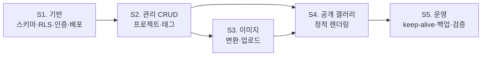

# 05. 구현 로드맵

> 설계 문서입니다. 이 문서의 스프린트 계획은 승인 후 구현 단계에서 실행합니다.

## 0. 계획의 원칙

### 0.1 왜 이 순서인가

일반적인 순서는 "화면부터 만들고 나중에 보안·운영을 붙이는" 것입니다.
여기서는 **반대로 갑니다.**

1. **RLS를 스프린트 1에 넣는 이유** — 나중에 붙이면, 이미 작성된 모든 쿼리가
   "RLS 없이 동작하는 것"을 전제로 만들어져 있습니다. 정책을 켜는 순간 여기저기서
   0건이 반환되고, 어디가 왜 막혔는지 추적하는 데 정책을 처음부터 짜는 것보다 오래 걸립니다.
   아키텍처 원칙에 "1일차부터"라고 못 박은 것도 같은 이유입니다.
2. **배포를 스프린트 1에 넣는 이유** — Vercel ↔ Supabase 연결, 환경 변수, 빌드 설정은
   나중에 몰아서 하면 문제가 한꺼번에 터집니다. **동작하는 뼈대(walking skeleton)를
   먼저 배포해 두고** 살을 붙입니다. 통합 리스크를 앞으로 당기는 것이 목적입니다.
3. **운영 장치(keep-alive/백업)를 마지막에 두는 이유** — 이건 위 둘과 달리
   나중에 붙여도 기존 코드에 영향을 주지 않는 **독립적인 부가물**이기 때문입니다.
   다만 **운영에 실데이터를 넣기 전에는 반드시 완료**되어야 합니다.

> 판단 기준: **"나중에 하면 이미 만든 것을 뜯어야 하는가?"**
> 그렇다면 앞으로 당기고, 아니라면 뒤로 미룹니다.

### 0.2 전체 흐름

- **S3와 S4는 둘 다 S2에 의존**하지만 서로 독립적입니다. 다만 S4의 목록 카드가
  대표 이미지를 쓰므로 **S3를 먼저 끝내는 편이 자연스럽습니다**
  (S4를 먼저 하려면 이미지 자리에 자리표시자를 넣어야 합니다)
- 기간은 명시하지 않습니다. 사이드 프로젝트라 가용 시간이 불규칙하고,
  틀린 일정은 계획으로서 해롭습니다. **범위와 완료 기준만 고정합니다.**

### 0.3 DoD를 읽는 법

각 스프린트의 완료 기준(Definition of Done)은 **"구현했다"가 아니라 "확인했다"** 로 씁니다.
검증 방법이 없는 항목은 DoD가 아닙니다.

---

## 스프린트 1 — 기반

**목표: 빈 화면이라도 좋으니, 인증과 RLS가 실제로 작동하는 것이 배포되어 있다.**

### 범위

| # | 작업 |
|---|---|
| 1-1 | Next.js 15 + TypeScript + Tailwind 프로젝트 초기화 |
| 1-2 | 로컬 Supabase(Docker) 구동, `supabase/config.toml` 설정 |
| 1-3 | 초기 마이그레이션 작성 — `02` §3의 4개 테이블 + ENUM + 제약 + 인덱스 + 트리거 |
| 1-4 | `is_admin()` 함수 + **전 테이블 RLS 정책** (`02` §5) |
| 1-5 | **명시적 GRANT** (`02` §5.3) — 2026-05-30 이후 프로젝트 필수 |
| 1-6 | Storage 버킷 2개 생성 + Storage 정책 (`02` §6) |
| 1-7 | 타입 생성 파이프라인 구축, `database.types.ts` 커밋 |
| 1-8 | Supabase 클라이언트 3종 (`03` §4.2) |
| 1-9 | 미들웨어 (matcher `/admin/:path*` 한정) |
| 1-10 | 로그인 / 로그아웃 (`/login`) |
| 1-11 | 관리자 대시보드 스텁 (`/admin`) — "로그인됨" 표시만 |
| 1-12 | 공개 홈 스텁 (`/`) — 정적 렌더링 확인용 |
| 1-13 | 운영 Supabase 프로젝트 생성 + 마이그레이션 push |
| 1-14 | 관리자 계정 생성 + `app_metadata.role = 'admin'` 부여 + **회원가입 비활성화** |
| 1-15 | Vercel 연결 + 환경 변수 설정 + 첫 배포 |
| 1-16 | 시드 데이터 (`supabase/seed.sql`) — 로컬 개발용 |

### 완료 기준 (DoD)

**환경**
- [ ] 로컬에서 `supabase start` → 마이그레이션 적용 → 앱 구동이 문서화된 절차로 재현됨
- [ ] 마이그레이션 적용 후 타입을 재생성했을 때 **diff가 없음**
- [ ] 운영 URL로 접속 시 공개 스텁 페이지가 뜸

**인증**
- [ ] 관리자 계정으로 로그인 → `/admin` 접근 성공
- [ ] 로그아웃 후 `/admin` 접근 → `/login`으로 리다이렉트
- [ ] 브라우저를 닫았다 열어도 세션이 유지됨
- [ ] Supabase 대시보드에서 **sign-up이 비활성화**되어 있음

**RLS — `02` §5.9 검증 시나리오 전체 통과**
- [ ] `draft` 프로젝트 1건을 시드로 넣어둔 상태에서
- [ ] 익명 키로 `projects` 조회 → 해당 행 **없음**
- [ ] 익명 키로 `project_images` **필터 없이 전체** 조회 → 해당 이미지 **없음**
- [ ] 익명 키로 `project_tags` **필터 없이 전체** 조회 → 해당 연결 **없음**
- [ ] 익명 키로 `projects` INSERT 시도 → **실패**
- [ ] 관리자 세션으로 위 조회 → **전부 보임**

> 이 검증은 앱 화면이 아니라 **REST 엔드포인트를 직접 호출해서** 해야 합니다.
> 화면으로 확인하면 "화면이 안 보여주는 것"과 "DB가 안 주는 것"을 구분할 수 없습니다.
> 이 구분이 이 프로젝트 보안 설계의 전부입니다.

**비용 안전**
- [ ] 미들웨어 matcher가 `/admin/:path*`로 한정되어 있음
- [ ] **배포된 JS 번들에 `service_role` 문자열이 존재하지 않음** (빌드 산출물 검색으로 확인)
- [ ] `/` 페이지가 빌드 로그에서 **정적(Static)으로 표시**됨

### 검토 체크포인트

1. **RLS 정책 4개 테이블 전부를 직접 읽어보고 설명할 수 있는가?**
   특히 `project_images`의 `EXISTS` 서브쿼리가 왜 필요한지 (`02` §5.5).
   여기를 이해하지 못한 채 넘어가면 이후 테이블을 추가할 때마다 같은 구멍을 만듭니다.
2. **`using`과 `with check`의 차이를 설명할 수 있는가?**
3. 미들웨어와 RLS 중 **어느 쪽이 보안 경계인지** 명확한가?
4. 마이그레이션 워크플로가 Flyway와 어떻게 대응되는지 감이 잡혔는가?
5. 빌드 로그에서 각 라우트가 Static / Dynamic 중 무엇으로 표시되는지 읽을 수 있는가?

### 이 스프린트에서 막힐 가능성이 높은 지점

- `app_metadata` 클레임을 부여했는데 권한이 안 먹음 → **재로그인 필요** (`02` §5.2)
- `force row level security`를 빠뜨려서 정책이 안 먹는 것처럼 보임 (`02` §5.4)
- GRANT 누락으로 `permission denied for table` (`02` §5.3)

---

## 스프린트 2 — 관리 CRUD

**목표: 이미지를 제외한 프로젝트 정보를 등록·수정·공개할 수 있다.**

**의존**: S1 완료 (스키마·인증 없이는 시작 불가)

### 범위

| # | 작업 | 유스케이스 |
|---|---|---|
| 2-1 | 데이터 접근 계층 — `features/projects/queries.ts` (`server-only`) | — |
| 2-2 | 입력 검증 스키마 — `features/projects/schema.ts` | — |
| 2-3 | Server Actions — 생성/수정/삭제/상태전환 | UC-PRJ-01~04 |
| 2-4 | 관리자 프로젝트 목록 (draft 포함, 상태 뱃지) | UC-PRJ-05 |
| 2-5 | 프로젝트 등록/수정 폼 | UC-PRJ-01, 02 |
| 2-6 | slug 자동 생성 + 수동 수정 + 중복 검사 | UC-PRJ-01 |
| 2-7 | 마크다운 에디터 + 미리보기 | UC-PRJ-06 |
| 2-8 | 태그 CRUD 화면 | UC-TAG-01, 03 |
| 2-9 | 태그 연결 UI (자동완성 + 신규 생성) | UC-TAG-02 |
| 2-10 | **태그 동기화 RPC** (`02` §7) — 원자적 쓰기 | — |
| 2-11 | 공개/비공개 토글 + `published_at` 정합성 | UC-PRJ-04 |
| 2-12 | 삭제 확인 다이얼로그 | UC-PRJ-03 |
| 2-13 | 오류 처리 방침 적용 (`03` §5.4) | — |

### 완료 기준 (DoD)

- [ ] 프로젝트를 등록하면 기본 상태가 **`draft`** 임
- [ ] 필수 항목 누락 시 **필드별 오류 메시지**가 표시됨 (전체 실패 메시지 아님)
- [ ] slug 중복 시 저장이 거부되고 명확한 안내가 나옴
- [ ] slug 형식 위반(대문자·공백·한글)이 **DB CHECK에서도** 막힘 (제약 직접 테스트)
- [ ] 태그를 3개 연결 → 1개 제거 → 2개 남음. 새로고침 후에도 동일
- [ ] 태그 동기화가 **RPC 한 번**으로 처리됨 (중간 실패 시 원자적 롤백)
- [ ] 종료일이 시작일보다 이르면 저장 거부 (DB 제약 동작 확인)
- [ ] `draft` ↔ `published` 전환 시 `published_at`이 규칙대로 채워지고 비워짐
- [ ] 프로젝트 삭제 시 `project_tags` 연결이 **DB CASCADE로** 함께 사라짐
- [ ] 마크다운 미리보기가 저장 없이 동작함
- [ ] 로그아웃 상태에서 Server Action을 직접 호출해도 **거부**됨

> 마지막 항목이 중요합니다. Server Action은 숨겨진 버튼이 아니라
> **공개 엔드포인트**입니다 (`03` §5.3). 인증 검사와 RLS가 둘 다 작동하는지 확인합니다.

### 검토 체크포인트

1. **Server Action이 어떻게 HTTP 요청이 되는지** 브라우저 네트워크 탭에서 확인했는가?
   Spring의 `@PostMapping`과 무엇이 같고 다른지 설명할 수 있는가?
2. `queries.ts`에 `import 'server-only'`가 왜 필요한지 이해했는가?
   (일부러 클라이언트 컴포넌트에서 import 해보고 빌드가 깨지는 것을 확인해 볼 것)
3. **트랜잭션 경계가 어디인지** 파악했는가? 왜 태그 동기화가 RPC여야 했는지.
4. 서버 컴포넌트와 클라이언트 컴포넌트의 경계를 어디에 그었는가?
   `'use client'`가 필요 이상으로 위쪽에 붙어 있지는 않은가?
5. 폼 상태 관리가 과하게 복잡해지지 않았는가? (React 초급 단계에서 흔한 함정)

---

## 스프린트 3 — 이미지 파이프라인

**목표: 이미지를 올리면 사전 변환되어 저장되고, 대표 이미지를 지정할 수 있다.**

**의존**: S2 완료 (프로젝트가 있어야 이미지를 붙임)

**이 스프린트가 기술적으로 가장 까다롭습니다.** 브라우저 API를 직접 다루고,
DB와 Storage라는 **트랜잭션이 없는 두 저장소**에 걸쳐 쓰기가 일어납니다.

### 범위

| # | 작업 | 유스케이스 |
|---|---|---|
| 3-1 | 파일 검증 (크기·MIME·해상도·장수) (`04` §2.6) | UC-IMG-01 |
| 3-2 | 브라우저 리사이즈 + WebP 인코딩 (thumb/md/lg) | UC-IMG-01 |
| 3-3 | LQIP(blur) 생성 | — |
| 3-4 | Storage 업로드 — variant → public, 원본 → private | UC-IMG-01 |
| 3-5 | `cacheControl: immutable` 설정 (`02` §6.5) | — |
| 3-6 | 메타데이터 저장 Server Action (`variants` JSONB 포함) | UC-IMG-01 |
| 3-7 | 대표 이미지 지정 — 부분 유니크 인덱스 대응 RPC | UC-IMG-02 |
| 3-8 | 순서 변경 · 삭제 | UC-IMG-03 |
| 3-9 | alt 텍스트 입력 | UC-IMG-04 |
| 3-10 | 업로드 진행 표시 · 실패 처리 | — |
| 3-11 | **고아 파일 처리 방침 구현** (`01` Q3의 답에 따름) | — |

### 완료 기준 (DoD)

- [ ] 3MB JPG 업로드 → **WebP 3종 + 원본**이 각각 올바른 버킷에 저장됨
- [ ] 변환 결과 용량이 `04` §2.2의 추정치와 **실측 비교**되었고, 표가 갱신됨
- [ ] 업로드된 이미지 URL의 응답 헤더에 `max-age=31536000, immutable`이 있음
- [ ] 대표 이미지를 A → B로 바꿔도 **유니크 인덱스 위반이 나지 않음**
- [ ] 대표 이미지가 프로젝트당 1개를 넘을 수 없음 (DB에서 직접 INSERT 시도해 확인)
- [ ] 이미지 삭제 시 DB 레코드와 Storage 파일이 방침대로 처리됨
- [ ] 10MB 초과 파일 업로드 시도 → 업로드 전에 거부됨
- [ ] 업로드 도중 실패했을 때 **일관성 없는 상태가 남지 않거나, 남더라도 복구 가능**함
- [ ] Storage 사용량을 확인했고 예상 범위 내임

> **부분 실패에 대한 현실적 방침**: Storage 업로드와 DB INSERT는 하나의 트랜잭션이 될 수 없습니다.
> "업로드 성공 + DB 실패"면 고아 파일이 남습니다. MVP에서는 이를 **허용하고 기록**합니다.
> 완벽한 정합성보다 **복구 가능성**을 목표로 합니다 (관리자가 1명이므로 수동 정리가 현실적).

### 검토 체크포인트

1. 변환된 이미지 **품질이 실제로 만족스러운가?** (수치가 아니라 눈으로 확인)
   불만족스러우면 지금이 규격을 바꿀 마지막 기회입니다 — 이후엔 재업로드가 필요합니다.
2. 큰 이미지 여러 장을 한 번에 올릴 때 **브라우저가 버티는가?**
3. `variants` JSONB 구조가 실제로 쓰기 편한가? 아니면 정규화가 나았겠는가?
   (`02` §3.4의 트레이드오프를 실물로 판단하는 시점)
4. 실측 용량으로 `04` §5의 추산이 여전히 유효한가?
5. 원본을 보관하기로 한 결정이 여전히 타당한가? (Storage 사용률 확인 후 판단)

---

## 스프린트 4 — 공개 갤러리

**목표: 방문자가 보는 화면이 완성되고, 정적으로 렌더링된다.**

**의존**: S2 (데이터), S3 (대표 이미지) — S3 없이 시작하면 자리표시자 작업이 추가됨

### 범위

| # | 작업 | 유스케이스 |
|---|---|---|
| 4-1 | 공개 레이아웃 (헤더/푸터), 폰트 전략 | — |
| 4-2 | 갤러리 목록 — SSG (`03` §3.1) | UC-PUB-01 |
| 4-3 | 태그 필터 — **클라이언트 처리 + URL 동기화** | UC-PUB-02 |
| 4-4 | 상세 페이지 — `generateStaticParams` + ISR | UC-PUB-03 |
| 4-5 | `generateStaticParams` **DB 실패 시 빈 배열 폴백** (`03` §3.1) | — |
| 4-6 | 마크다운 서버 렌더링 + 살균 (`03` Q1, `01` Q4) | UC-PUB-03 |
| 4-7 | 이미지 갤러리 · 라이트박스 | UC-PUB-03 |
| 4-8 | on-demand ISR 연결 — **이전 slug 무효화 포함** (`03` §3.2) | — |
| 4-9 | 반응형 대응 | UC-PUB-04 |
| 4-10 | 404 / 오류 페이지 | UC-PUB-05 |
| 4-11 | `robots.txt` — 관리 경로 차단 | — |
| 4-12 | 접근성 점검 (alt, 색 대비, 키보드) | NFR-06 |
| 4-13 | 기본 메타데이터 · OG 태그 (2단계 SEO의 최소분) | — |

### 완료 기준 (DoD)

- [ ] 빌드 로그에서 `/`와 `/projects/[slug]`가 **Static / ISR**로 표시됨
      (**Dynamic이면 이 스프린트는 실패입니다** — 비용 설계의 근간이 무너집니다)
- [ ] 태그 필터를 조작해도 **네트워크 요청이 발생하지 않음** (네트워크 탭으로 확인)
- [ ] 필터 상태가 URL에 반영되고, 새로고침·공유 후에도 유지됨
- [ ] **`draft` 프로젝트의 slug로 직접 접근 → 404** (403 아님)
- [ ] 관리 화면에서 저장 → 공개 페이지에 **재검증 후 반영**됨
- [ ] slug를 변경한 경우 **이전 URL의 캐시도 무효화**됨
- [ ] **Supabase 프로젝트를 일시정지시킨 상태에서 공개 페이지가 정상 동작함** (NFR-03)
- [ ] 모바일 뷰포트에서 레이아웃이 깨지지 않음
- [ ] 모든 이미지에 alt가 있음
- [ ] Lighthouse 측정값을 기록 (NFR-05 목표치를 실측으로 확정)
- [ ] `robots.txt`가 `/admin`을 차단함

> **일시정지 테스트를 DoD에 넣은 이유**: 이 아키텍처의 핵심 주장(NFR-03)이
> 실제로 성립하는지 확인하는 유일한 방법입니다. 주장만 하고 검증하지 않으면
> 설계 문서의 신뢰도가 무너집니다. 테스트 후 반드시 재개할 것.

### 검토 체크포인트

1. **빌드 로그의 라우트 표를 직접 읽고**, 각 페이지의 렌더링 방식이 의도대로인지 확인했는가?
2. 정적이어야 할 페이지가 동적으로 바뀌는 조건들(`searchParams`, 캐시 없는 `fetch`,
   `cookies()`/`headers()` 접근)을 이해했는가?
3. 클라이언트 번들 크기가 얼마인가? 예상보다 크다면 무엇이 들어갔는가?
4. **채용 담당자 관점에서 실제로 보기 좋은가?** — 기술 검토가 아니라 콘텐츠·디자인 관점.
   이 프로젝트의 존재 이유가 여기서 판정됩니다.
5. 이미지가 Supabase CDN에서 서빙되고 Vercel을 거치지 않는가? (네트워크 탭 도메인 확인)

---

## 스프린트 5 — 운영 장치

**목표: 방치해도 죽지 않고, 사고가 나도 복구할 수 있다.**

**의존**: S4 완료 (운영 배포가 완성된 뒤에 운영 장치를 붙임)

**이 스프린트를 끝내기 전에는 운영 DB에 실제 콘텐츠를 채우지 않습니다.**
백업 없이 데이터를 쌓는 기간을 만들지 않기 위해서입니다.

### 범위

| # | 작업 | 유스케이스 |
|---|---|---|
| 5-1 | `/api/keep-alive` Route Handler (`04` §1.5) — **force-dynamic 필수** | UC-SYS-01 |
| 5-2 | GitHub Actions 워크플로 — keep-alive + 백업 통합 (`04` §4.3) | UC-SYS-01, 02 |
| 5-3 | 백업 저장용 private 리포 준비 (`04` Q2) | UC-SYS-02 |
| 5-4 | `pg_dump` 연결 문제 해결 (pooler / 클라이언트 버전) (`04` §4.3) | UC-SYS-02 |
| 5-5 | Vercel Cron 보조 keep-alive (`04` Q5의 답에 따름) | UC-SYS-01 |
| 5-6 | **복구 리허설** (`04` §4.5) | — |
| 5-7 | Vercel 사용량 알림 설정 | — |
| 5-8 | 운영 체크리스트 문서화 | — |
| 5-9 | 실제 프로젝트 콘텐츠 입력 | — |
| 5-10 | 최종 사용량 실측 및 `04` §5 추산 갱신 | — |

### 완료 기준 (DoD)

- [ ] GitHub Actions 워크플로를 **수동 실행**해서 성공하는 것을 확인
- [ ] 실행 후 Supabase 대시보드에 **DB 요청이 기록**됨 (keep-alive가 실제로 닿았는지)
- [ ] `/api/keep-alive`가 **캐시되지 않음** (연속 호출 시 타임스탬프가 매번 갱신됨)
- [ ] `/api/keep-alive`가 시크릿 헤더 없이 호출되면 **거부**됨
- [ ] 백업 덤프가 private 리포에 커밋됨. 파일 크기 확인
- [ ] **복구 리허설 완료** — 덤프를 로컬 Supabase에 실제로 복원하고
      프로젝트 수·태그 연결·이미지 메타데이터가 온전함을 확인. **소요 시간 기록**
- [ ] 워크플로를 일부러 실패시켜 **실패 알림 이메일이 오는지** 확인
- [ ] Vercel 사용량 알림이 설정됨
- [ ] 운영 체크리스트가 문서로 존재함
- [ ] 실 콘텐츠 입력 후 각 한도 사용량을 실측하고 `04` §5 표를 갱신

> **"실패 알림이 오는지 확인"** 이 DoD에 있는 이유: keep-alive가 조용히 멈추는 것이
> 이 프로젝트의 가장 현실적인 사망 원인입니다 (`04` §1.6).
> 감시 장치 자체가 작동하는지 확인하지 않으면 감시가 없는 것과 같습니다.

### 검토 체크포인트

1. **복구 리허설에서 실제로 얼마나 걸렸는가?** 막힌 지점을 문서에 남겼는가?
2. keep-alive가 멈췄을 때 **며칠 안에 알아챌 수 있는가?** 최대 공백은?
3. 백업 리포에 `draft` 콘텐츠가 들어 있다는 사실을 인지하고, private 설정을 확인했는가?
4. 실측 사용량이 추산과 얼마나 달랐는가? 크게 빗나갔다면 원인은?
5. **한 달 뒤에 다시 확인할 일정을 잡았는가?** (첫 달 실측이 가장 중요합니다)

---

## 스프린트 간 의존관계 요약

| 스프린트 | 선행 | 산출물 중 다음이 쓰는 것 |
|---|---|---|
| S1 | — | 스키마, RLS, 인증, 배포 환경, 생성 타입 |
| S2 | S1 | 프로젝트/태그 데이터, 데이터 접근 계층 패턴 |
| S3 | S2 | 이미지 메타데이터, 대표 이미지 |
| S4 | S2 (+S3 권장) | 공개 화면, 재검증 흐름 |
| S5 | S4 | 운영 안정성 |

**병렬화 가능성**: S3와 S4는 이론상 병렬이지만, 1인 프로젝트에서 병렬 작업은
컨텍스트 전환 비용만 늘립니다. **순차 진행을 권합니다.**

---

## 2단계 이후 (착수 시점 미정)

| 항목 | 선행 조건 | 설계상 준비된 것 |
|---|---|---|
| GitHub API 연동 | 5스프린트 완료 | `RepositoryProvider` 인터페이스 (`03` §7) |
| 조회수 통계 | — | 별도 이벤트 테이블 설계 (`01` §4의 사유) |
| SEO 고도화 (sitemap, OG 이미지, JSON-LD) | 콘텐츠 축적 | slug 안정성, `summary` 필수, 대표 이미지 |
| 태그별 페이지 | SEO 성과 확인 후 | 라우팅만 추가 (`03` §2) |

**2단계 착수 전에 반드시 재검토할 것**: `04` §5의 실측 사용량.
GitHub API 연동과 조회수 통계는 둘 다 **DB 쓰기와 함수 호출을 늘립니다.**
현재 여유가 커 보여도, 착수 시점의 실제 수치로 다시 판단해야 합니다.

---

## 결정이 필요한 항목

- **Q1. S3(이미지)와 S4(공개 갤러리)의 순서를 바꾸고 싶으십니까?**
  공개 화면을 먼저 보면 동기 부여에 도움이 됩니다. 대신 이미지 자리표시자 작업이
  추가로 발생하고 나중에 되돌려야 합니다. 권고: **S3 → S4 순서 유지.**

- **Q2. S1의 "빈 화면 배포"를 생략하고 S4 이후에 한 번에 배포할까요?**
  생략하면 초기 진행이 빨라 보이지만, 배포 관련 문제가 후반에 몰립니다.
  권고: **S1에서 배포까지 완료.** (통합 리스크를 앞으로 당기는 것이 목적)

- **Q3. 각 스프린트마다 제가 리뷰할 시점을 어떻게 잡을까요?**
  (a) 스프린트 종료 시 일괄 리뷰
  (b) 주요 작업 단위마다 중간 리뷰
  TypeScript/React가 초급이라면 **S2까지는 (b), 이후 (a)** 를 권합니다.
  초반 패턴이 굳으면 이후 코드가 전부 그 패턴을 따라가기 때문입니다.

- **Q4. 테스트 코드를 어느 범위까지 작성할까요?**
  본 설계에서는 명시하지 않았습니다. 1인 사이드 프로젝트에서 전면적인 테스트는
  과합니다만, **RLS 정책 검증만큼은 자동화 가치가 높습니다**(수동으로 매번 확인하기 번거롭고
  놓치면 치명적). 권고: **RLS 검증 시나리오만 스크립트화**, 나머지는 수동.

- **Q5. 진행 중 설계 변경이 생기면 이 문서들을 갱신할까요?**
  갱신하지 않으면 문서와 실제가 갈라져 나중에 쓸모가 없어집니다.
  권고: **각 스프린트 DoD에 "관련 문서 갱신"을 포함.**
  특히 `04` §2.2(이미지 실측)와 `04` §5(사용량 실측)는 실측값으로 대체되어야 합니다.
