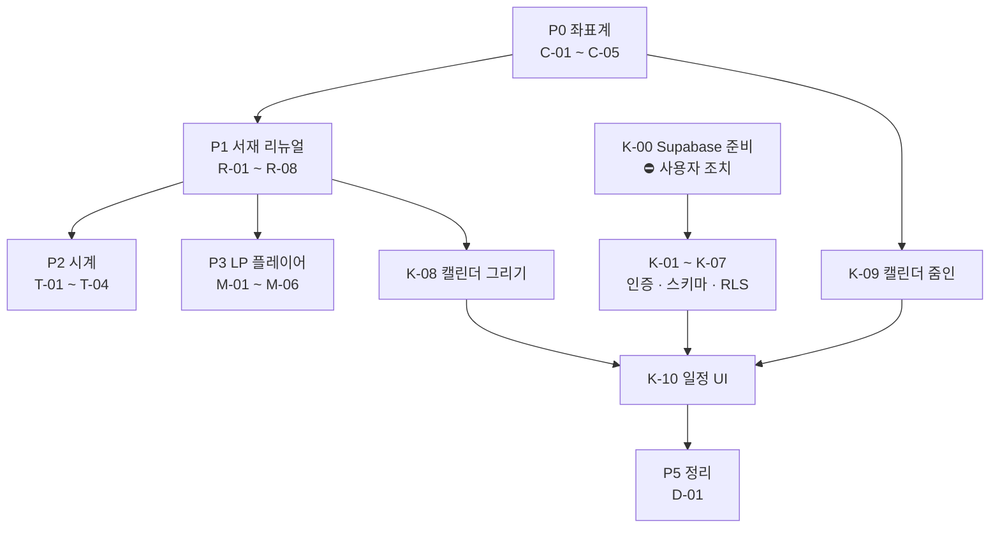

# 06. 서재 리뉴얼 WBS

`05-roadmap.md` 의 스프린트 계획을 이번 리뉴얼 범위로 다시 쪼갠 문서입니다.
작업 단위, 의존 관계, 완료 기준을 정해 두고 순서대로 진행합니다.

---

## 1. 배경

### 왜 리뉴얼인가

**(1) 모바일 배치가 깨져 있습니다 — 설계 결함입니다.**

현재 사물 좌표가 서로 다른 기준을 씁니다.

```
left, width  →  뷰포트 '폭'의 %
top          →  뷰포트 '높이'의 %
```

세로 화면(375×812)에서는 폭이 좁아 물건이 작아지는데 높이는 길어서 위아래로 흩어집니다.
가구(선반·책상)도 각자 다른 기준으로 움직이니 **물건과 가구가 따로 놉니다.**
값을 조정해서 될 문제가 아니라 좌표계를 바꿔야 합니다.

**(2) 방의 성격을 "개인 서재"로 명확히 합니다.**

지금은 물건이 놓인 방일 뿐 "공부하는 사람의 공간"으로 읽히지 않습니다.
책장·책 더미·서류·스탠드를 넣어 현실적인 개인 공간으로 만듭니다.

**(3) 기능 세 가지가 추가됩니다.** 시계 · LP 플레이어 · 캘린더.

### 확정된 결정

| 항목             | 결정                                 | 근거                                                 |
| ---------------- | ------------------------------------ | ---------------------------------------------------- |
| 분위기           | **차분하고 사실적인 서재**           | 나무·종이·황동빛 중심. 색을 가라앉히고 디테일을 늘림 |
| 캘린더 공개 범위 | **나만 보는 비공개**                 | 진짜 일정관리. → Supabase + Auth + RLS 필요          |
| 캘린더 형태      | **벽걸이**                           | 탁상이 아님. 벽에 걸어 시선을 위로 분산              |
| 캘린더 비로그인  | **안내 + 로그인 이동 버튼**          | 장면에 남아 있되 정직하게                            |
| 음악 재생        | **유튜브 임베드 목록**               | 대역폭 0, 곡 교체가 쉬움                             |
| 시계             | **벽시계 제거, 탁상시계만 실시간**   | 두 시계가 다 돌면 시선이 분산됨                      |
| **모바일**       | **이번 리뉴얼에서 제외. PC 만 진행** | PC 가 끝난 뒤 할지 말지 다시 판단                    |
| 밤/낮 토글       | **유지**                             | 기존 자산을 살림                                     |

### 모바일을 미루는 것과 "깨진 채 두는 것"은 다릅니다

고정 무대(C-01)를 도입하면 **모바일은 저절로 정상이 됩니다.**
무대를 통째로 축소하므로 물건이 가구 위에 그대로 있고, 다만 작게 보일 뿐입니다.
지금의 "공중에 뜬 뒤죽박죽" 상태는 P0 만으로 사라집니다.

이번에 미루는 것은 **세로 화면 전용 배치와 조작감 다듬기**이지, 모바일 방치가 아닙니다.

### 유튜브 임베드로 감수하는 것 (재논의 방지용 기록)

- **광고를 막을 수 없습니다.** 영상 주인의 수익화 설정이 정하며 우리가 통제 못 합니다
- **프리미엄은 사이트가 아니라 보는 사람에게 붙습니다.** 운영자 계정과 무관합니다
- 영상이 삭제·비공개되면 그 항목이 깨집니다 → 주기 점검 필요
- iframe 이라 플레이어 디자인을 서재 톤에 맞출 수 없습니다
- 광고가 실제로 거슬리면 그때 음원 파일 직접 호스팅으로 전환합니다 (M-05 참조)

---

## 1.5 진행 방식 (2026-07-29 변경)

초기에 사물 12개를 한 번에 배치했다가 물건이 가구에서 뜨고 서로 겹쳐,
사용자가 하나하나 찾아내 알려주는 일이 반복됐습니다. 방식을 바꿉니다.

**규칙 1 — 한 번에 하나씩 놓는다.**
새 요소(가구·사물·기능)는 하나 놓고 확인받은 뒤 다음으로 갑니다.
여러 개를 동시에 배치하지 않습니다. 좌표는 감으로 잡을 수밖에 없어
한 번에 여러 개를 놓으면 어디가 틀렸는지 가려내는 비용이 더 큽니다.

**규칙 2 — 좌표는 한 파일에만 둔다.**
`src/content/layout.ts` 가 유일한 배치 파일입니다.
수정 요청이 오면 이 파일의 숫자만 고치면 모든 화면에 함께 반영됩니다.

**규칙 3 — 애매해도 멈추지 않는다.**
질문할 지점이 생겨도 요청받은 작업을 먼저 전부 끝내고,
열린 질문은 §9 TODO 에 남깁니다.

**규칙 4 — 커밋·푸시는 지시받을 때만 한다.**
작업 단위마다 푸시하면 배포가 계속 돌아 확인 요구가 잦아지고 흐름이 끊깁니다.
빌드와 타입 검사까지만 하고 작업 상태로 둡니다.

---

## 2. 순서를 정하는 기준

1. **다른 작업의 좌표를 바꾸는 것이 먼저.**
   좌표계를 나중에 고치면 시계·LP·캘린더를 두 번 배치해야 합니다.
2. **막히는 것은 일찍 드러낸다.**
   캘린더는 인프라(Supabase)가 필요하고 그건 사용자 조치가 필요합니다.
   지금 알려서 병렬로 풀 수 있게 합니다.
3. **눈에 보이는 것을 먼저.**
   서재 리뉴얼이 끝나면 나머지는 그 위에 얹는 일이라 중간 확인이 쉬워집니다.
4. **작고 독립적인 것은 사이에 끼운다.** 시계가 그렇습니다.

---

## 3. 작업 분해

크기 표기: **S** 작음 · **M** 보통 · **L** 큼

### P0 — 좌표계 (모든 것의 토대)

> **P0 와 P1 은 한 번에 진행합니다.**
> C-04(좌표 이전)와 R-02·R-03(책장·책상 새로 그리기)이 같은 작업입니다.
> 나눠서 하면 옛 가구로 한 번, 새 가구로 또 한 번 물건을 배치하게 됩니다.
> 정확히 피하려던 중복이라 묶습니다.

| ID       | 작업                                                          | 크기 | 의존 |
| -------- | ------------------------------------------------------------- | ---- | ---- |
| C-01     | 고정 비율 무대(artboard) 도입. 방을 1600×900 좌표계 안에 그림 | M    | —    |
| C-02     | 무대를 뷰포트에 맞춰 확대·축소(cover)하고 중앙 정렬           | S    | C-01 |
| ~~C-03~~ | ~~세로 화면 안전 영역~~ — **모바일 보류로 제외**              | —    | —    |
| C-04     | 모든 사물·가구 좌표를 무대 좌표(px)로 이전                    | M    | C-01 |
| C-05     | 카메라 계산을 무대 좌표 기준으로 수정                         | S    | C-04 |

**완료 기준**

- [ ] 데스크톱(16:9)·노트북(16:10)·와이드(21:9)에서 **물건이 전부 가구 위에** 놓여 있음
- [ ] 창을 극단적으로 늘리거나 줄여도 물건이 가구에서 떨어지지 않음
- [ ] 카메라 줌인 시 대상이 화면 지정 위치에 정확히 옴
- [ ] 모바일에서도 **깨져 보이지 않음** (작게 보이는 것은 허용, 뜬 물건은 불가)

> **왜 이게 1번인가**: 이걸 안 하면 시계를 책상에 올리고, 나중에 좌표계를 바꾸고,
> 시계를 다시 올려야 합니다. LP·캘린더도 마찬가지입니다. 네 번 할 일을 한 번으로 만듭니다.

---

### P1 — 서재 리뉴얼

| ID   | 작업                                                       | 크기 | 의존 |
| ---- | ---------------------------------------------------------- | ---- | ---- |
| R-01 | 색 팔레트 재조정 — 채도를 낮추고 나무·종이·황동 계열로     | S    | —    |
| R-02 | **책장** 신규 — 벽면 한쪽을 채우는 책장과 꽂힌 책들        | L    | C-01 |
| R-03 | 책상 확장 — 상판을 넓히고 서랍·다리 구조를 사실적으로      | M    | C-01 |
| R-04 | 책상 위 소품 보강 — 노트·서류철·필통·안경·스탠드           | M    | R-03 |
| R-05 | 바닥·벽 질감 — 마루결, 벽지, 걸레받이 정리                 | S    | —    |
| R-06 | 조명 재설계 — 창빛 + 스탠드 빛의 두 광원, 그림자 방향 통일 | M    | R-01 |
| R-07 | 기존 사물 12종을 새 톤에 맞게 재도색                       | M    | R-01 |
| R-08 | 밤 모드를 새 팔레트에 맞춰 재조정                          | S    | R-06 |

**완료 기준**

- [ ] "사람이 실제로 공부하는 방"으로 읽힘 — 물건이 떠 있지 않고 놓여 있음
- [ ] 광원이 두 개(창·스탠드)이고 그림자 방향이 전부 일관됨
- [ ] 낮/밤 모두 색이 무너지지 않음
- [ ] 이미지 파일 추가 없이 CSS/SVG 로만 (`docs/04` 이미지 전략 유지)

---

### P2 — 책상 시계

| ID   | 작업                                            | 크기 | 의존 |
| ---- | ----------------------------------------------- | ---- | ---- |
| T-01 | 책상용 탁상시계 그리기 (벽시계와 별개)          | S    | R-03 |
| T-02 | KST 실시간 시:분:초 동작                        | S    | T-01 |
| T-03 | 서버/클라이언트 시간 불일치 처리 (하이드레이션) | S    | T-02 |
| T-04 | 초침이 보이도록 확대 시 가독성 확보             | S    | T-02 |

**완료 기준**

- [ ] 실제 KST 와 초 단위까지 일치 (시스템 시간대와 무관하게 항상 KST)
- [ ] 하이드레이션 경고 없음
- [ ] 탭을 오래 열어두거나 절전 후 복귀해도 시간이 어긋나지 않음
- [ ] `prefers-reduced-motion` 에서도 시간은 갱신됨 (초침 애니메이션만 생략)

> 시계는 다른 작업과 얽히지 않아 중간에 끼우기 좋습니다.
> 서버에서 렌더링한 시각과 브라우저 시각이 달라 하이드레이션 경고가 나기 쉬운 것만 주의합니다.

---

### P3 — LP 플레이어

| ID   | 작업                                                      | 크기 | 의존 |
| ---- | --------------------------------------------------------- | ---- | ---- |
| M-01 | LP 판 + 턴테이블 그리기, 책상 위 배치                     | M    | R-03 |
| M-02 | 재생목록 데이터 구조 (`content/playlist.ts`)              | S    | —    |
| M-03 | 클릭 → 곡 목록 패널 (기존 카드 방식 재사용)               | M    | M-02 |
| M-04 | 유튜브 IFrame API 연결, 재생/정지/다음                    | M    | M-03 |
| M-05 | 재생 중 상태 표시 — 판이 도는 표시, 항상 보이는 정지 버튼 | S    | M-04 |
| M-06 | 자동재생 금지 · 소리 상태 기억(localStorage)              | S    | M-04 |
| M-07 | **플레이어를 판 가운데로 옮기고 회전 제거** (2026-07-29)  | M    | M-05 |

#### M-07 → M-08 — LP 를 걷어내고 아이패드로 (2026-07-29)

플레이어를 놓을 자리를 네 번 옮긴 끝에 나온 배치라 이유를 남겨 둡니다.

1. 화면 구석의 작은 플레이어 → 눈에 거슬린다는 지적
2. 감추거나 앞을 덮는 방법 → **폐기.** 유튜브 약관이 금지하는 건 `display:none` 이라는
   **구현**이 아니라 "플레이어가 보이지 않게 되는 **결과**"입니다. 앞에 그림을 덮는 것도 같은 위반
3. 벽걸이 LP 판 가운데 → 판이 원형이라 16:9 도 정사각도 어딘가 어색했음
4. **책상 오른쪽 끝의 아이패드** ← 지금

**왜 아이패드가 답인가.** 기기 화면이 원래 사각형이라 iframe 이 어색한 여백 없이
화면을 정확히 채웁니다. 감출 이유도, 깎을 이유도 없어집니다.

| 결정                                        | 이유                                                                                                                                                                                                                                              |
| ------------------------------------------- | ------------------------------------------------------------------------------------------------------------------------------------------------------------------------------------------------------------------------------------------------- |
| 화면 4:3                                    | 아이패드로 읽히는 비율. iframe 이 화면을 정확히 채웁니다                                                                                                                                                                                          |
| 방에서는 iframe 이 **화면 전체**            | 사용자 요청. 기기 모양이 곧 플레이어 테두리가 됩니다                                                                                                                                                                                              |
| 방 화면에 **재생 버튼 없음**                | 화면 안 iframe 이 유튜브 플레이어 자체라 컨트롤을 이미 갖고 있습니다.<br>밖에 또 두면 같은 일을 하는 조작부가 둘이 됩니다                                                                                                                         |
| 클릭해서 확대하는 곳은 **테두리 고리**      | 화면 위를 덮으면 플레이어를 가리는 것. 화면은 `z-index` 로 위에 두어<br>안쪽 클릭은 유튜브가 그대로 받습니다                                                                                                                                      |
| 확대 시 **화면 안에** 유튜브 뮤직 UI        | 밖에 패널을 띄우면 기기 밖으로 UI 가 새어 나와 어색합니다.<br>영상이 자리를 좁혀 주고 그 옆·아래에 대기열과 조작 막대가 들어갑니다                                                                                                                |
| **진행 막대를 그리지 않음**                 | 영상 안에 유튜브 플레이어의 진행 막대가 이미 있습니다. 그건 플레이어의 일부라 가릴 수 없으니, 없앨 수 있는 쪽은 우리 것뿐입니다. 탐색·시간 표시는 유튜브 컨트롤에 맡기고 이전/다음만 남깁니다 — 재생목록은 우리 것이라 유튜브 컨트롤에는 없습니다 |
| 확대해도 iframe 을 **DOM 에서 옮기지 않음** | 노드를 옮기면 iframe 이 다시 로드됩니다 = 음악이 끊깁니다.<br>자리는 그대로 두고 **CSS 크기만** 바꿉니다                                                                                                                                          |
| 스탠드를 왼쪽 끝으로                        | 책상 오른쪽 320px 에 스탠드와 아이패드가 같이 안 들어갑니다.<br>다만 밤 조명이 왼쪽에서 오게 되어 그림자 방향(왼쪽 아래)과 어긋납니다 → Q-E                                                                                                       |

**최소 200×200 문제는 저절로 풀렸습니다.**
모니터·캘린더와 같은 역-축척을 아이패드 화면에도 적용했더니(`RoomShell` 의 `fit`),
iframe 의 CSS 크기가 늘 "확대했을 때 크기"(1920×1080 화면에서 **698×587**)가 됩니다.
방 화면에서 작게 보이는 건 그 위에 걸린 transform 때문이지 iframe 이 작아서가 아닙니다.
LP 안에 넣었을 때 214px 로 아슬아슬하던 값을 더 이상 신경 쓸 필요가 없습니다.

**헤드리스 브라우저로 실측했습니다** (1920×1080). 이번에 이렇게 잡은 것들:

| 잡은 것                    | 내용                                                                                                                                                    |
| -------------------------- | ------------------------------------------------------------------------------------------------------------------------------------------------------- |
| 플레이어가 화면을 안 채움  | `music.css` 를 `MusicApp` 에서만 import 했는데 `.ytm` 마크업은<br>`DeskPad` 에 늘 있습니다. 방 화면에서 스타일이 없어 312×**106** 으로 쪼그라들었습니다 |
| 시계가 상판 아래로         | `.clockSpot` 은 높이가 0 인데 `.clock` 에 위치가 없어 그 지점에서<br>**아래로** 자랐습니다. 서랍 앞에 걸려 있었습니다. `bottom:0` 으로 고정             |
| /music 에 나가기 버튼 없음 | 버튼·HUD·Esc 가 `inScreen                                                                                                                               |     | inCalendar` 만 봤습니다.<br>`zoomedIn` 플래그 하나로 합쳤습니다 |
| 확대해도 책상이 선명       | 아이패드가 `.l-desk` 에 있어 그 층을 통째로 흐리게 할 수 없습니다.<br>`.l-desk > *:not(.pad)` 로 아이패드만 남기고 흐리게                               |

**완료 기준**

- [ ] **어떤 경우에도 자동 재생되지 않음** — 반드시 사용자가 눌러야 소리가 남
- [ ] 정지 버튼이 재생 중 항상 화면에 보임
- [ ] 다른 화면(갤러리·캘린더)으로 이동해도 재생이 끊기지 않음
- [ ] 영상이 삭제된 항목은 오류 없이 건너뜀
- [ ] 모바일에서 동작 (iOS 는 사용자 제스처 없이는 소리가 안 납니다 — 클릭으로 시작하므로 충족)

> **채용 담당자는 사무실에서 소리를 켜고 봅니다.** 자동재생은 도움이 아니라 피해입니다.
> 이 원칙은 구현 편의보다 우선합니다.

---

### P4 — 캘린더 (인프라 필요)

비공개 일정이므로 **로그인과 DB 가 필요합니다.** `docs/02` · `docs/03` 의 설계를 여기서 처음 실제로 적용합니다.

| ID       | 작업                                                         | 크기 | 의존       | 비고                    |
| -------- | ------------------------------------------------------------ | ---- | ---------- | ----------------------- |
| **K-00** | **Supabase 프로젝트 준비**                                   | S    | —          | ⛔ **사용자 조치 필요** |
| K-01     | Supabase 클라이언트 3종 + 환경변수                           | S    | K-00       | `docs/03` §4.2          |
| K-02     | 관리자 계정 생성 + `app_metadata.role=admin` + 가입 비활성화 | S    | K-00       | `docs/03` §4.5          |
| K-03     | `events` 테이블 스키마 + 제약                                | S    | K-01       |                         |
| K-04     | RLS 정책 — **본인만 읽기·쓰기**                              | M    | K-03       | `docs/02` §5            |
| K-05     | 명시적 GRANT (2026-05-30 이후 프로젝트)                      | S    | K-03       | `docs/02` §5.3          |
| K-06     | 타입 생성 파이프라인                                         | S    | K-03       | `docs/02` §9            |
| K-07     | 로그인 화면 + 미들웨어 (`/admin` 한정)                       | M    | K-02       | `docs/03` §4.3          |
| K-08     | 벽걸이 캘린더 그리기 + 배치                                  | M    | R-02       |                         |
| K-09     | 캘린더 줌인 화면 (모니터와 같은 방식)                        | M    | K-08, C-05 |                         |
| K-10     | 월 보기 · 일정 추가/수정/삭제 UI                             | L    | K-09       |                         |
| K-11     | 로그인 안 한 방문자에게 보이는 화면                          | S    | K-07       | 일정 대신 안내          |

**완료 기준**

- [ ] **로그아웃 상태에서 익명 키로 `events` 를 직접 조회 → 0건** ← 가장 중요
- [ ] 로그인 후 일정 추가·수정·삭제가 되고 새로고침해도 남아 있음
- [ ] 캘린더 줌인/줌아웃이 모니터와 같은 감각으로 동작
- [ ] 방문자에게는 일정 내용이 어떤 경로로도 노출되지 않음
- [ ] `robots` 에서 `/admin` 차단

> **왜 마지막인가**: 인프라 준비(K-00)가 사용자 조치를 기다려야 하고,
> 캘린더 배치(K-08)가 책장 위치(R-02)에 의존하며,
> 줌인(K-09)이 새 좌표계(C-05)에 의존합니다. 앞이 다 끝나야 깨끗하게 붙습니다.

---

### P5 — 정리

| ID   | 작업                                         | 크기 | 의존       |
| ---- | -------------------------------------------- | ---- | ---------- |
| D-01 | `docs/02`·`03`·`05` 를 실제 구현에 맞게 갱신 | M    | P4         |
| D-02 | 실제 저장소 목록으로 `projects.ts` 교체      | M    | —          |
| D-03 | 실제 이력으로 `resume.ts` 교체               | S    | —          |
| D-04 | `robots` 색인 열기                           | S    | D-02, D-03 |

> D-02 · D-03 은 다른 작업과 무관하므로 **언제든 끼워 넣을 수 있습니다.**
> 실제 자료가 준비되는 대로 알려주시면 그때 처리합니다.

---

## 4. 의존 관계



**병렬로 가능한 것**

- K-00 (Supabase 준비)은 **지금 당장** 시작할 수 있습니다. P0~P3 와 무관합니다
- D-02 · D-03 (실제 콘텐츠)도 언제든 가능합니다

---

## 5. 지금 막혀 있는 것

| #   | 막힌 것           | 필요한 조치                                     | 누가   |
| --- | ----------------- | ----------------------------------------------- | ------ |
| 1   | **K-00 Supabase** | Docker Desktop 설치 **또는** 원격 프로젝트 생성 | 사용자 |
| 2   | **M-02 재생목록** | 넣고 싶은 유튜브 영상/재생목록 주소             | 사용자 |
| 3   | D-02 프로젝트     | 실제 저장소 주소 — **1건 접수**(yutnori, 2026-07-29). 나머지 | 사용자 |
| 4   | D-03 이력서       | 실명·회사·학력·자격증                           | 사용자 |

**1번은 지금 시작하시는 게 좋습니다.** P0~P3 를 진행하는 동안 병렬로 풀리면
캘린더에 도달했을 때 기다리지 않습니다.

---

## 6. 리스크

| 리스크                            | 영향          | 대응                                                                             |
| --------------------------------- | ------------- | -------------------------------------------------------------------------------- |
| **세로 화면에서 서재가 답답해짐** | 높음          | C-03 에서 안전 영역을 정하고, 실기기로 확인한 뒤 다음 단계 진행                  |
| 책장·책 SVG 가 무거워짐           | 중간          | 책은 반복 패턴으로 그리고 개별 도형 수를 제한. 초기 HTML 크기를 측정하며 진행    |
| 유튜브 영상 삭제                  | 중간          | 오류 시 조용히 건너뛰고, 분기별 점검을 운영 체크리스트에 추가                    |
| 캘린더 RLS 실수로 일정 노출       | **매우 높음** | K-04 완료 기준의 익명 조회 테스트를 반드시 수행. 통과 전에는 실제 일정 입력 금지 |
| 카메라 대상이 늘어 조작이 헷갈림  | 중간          | 줌인 대상은 모니터·캘린더 둘로 한정. 나머지는 카드로 처리                        |
| 작업 중 배포가 깨짐               | 낮음          | 각 P 단위로 빌드 확인 후 푸시. 라우트 표가 Static/SSG 인지 매번 확인             |

---

## 7. 진행 방식

- **P 단위로 끊어서 푸시**합니다. 각 P 가 끝나면 배포하고 확인받은 뒤 다음으로 갑니다
- 각 P 완료 시 **완료 기준 체크리스트를 실제로 확인**하고 결과를 보고합니다
- 중간에 방향을 바꾸고 싶으면 P 경계에서 바꾸는 것이 가장 쌉니다

---

### P6 — 창밖 (실제 날씨 · 시각 · 계절) — 2026-07-29

| ID   | 작업                                                  | 크기 | 의존 |
| ---- | ----------------------------------------------------- | ---- | ---- |
| W-01 | 날씨 API 고르기 · `lib/sky.ts`                        | S    | —    |
| W-02 | `/api/weather` — 1시간 캐시 프록시                    | S    | W-01 |
| W-03 | `useSky` — 1시간 통신 / 1분 계산                      | M    | W-02 |
| W-04 | 해·달이 실제 일출·일몰을 따라 창을 가로지름           | M    | W-03 |
| W-05 | 날씨 일곱 가지 그리기 (비·눈·안개·번개·구름·채도)     | L    | W-03 |
| W-06 | 계절 나무 (봄 꽃 · 여름 초록 · 가을 단풍 · 겨울 앙상) | M    | W-03 |
| W-07 | 밝기 버튼을 자동/낮/밤 3단으로                        | S    | W-03 |

#### 왜 Open-Meteo 인가

**API 키가 없습니다.** 가입도, 키 발급도, 키를 숨길 곳도 필요 없습니다.
지금까지 지켜 온 "`NEXT_PUBLIC_` 에 비밀을 두지 않는다" 규칙과 충돌할 일이 아예 없습니다.
비영리 무료, 하루 10,000회.

| 후보                   | 왜 안 골랐나                                                   |
| ---------------------- | -------------------------------------------------------------- |
| OpenWeatherMap         | 키 필요. 브라우저에서 부르면 노출, 숨기려면 어차피 서버가 필요 |
| 기상청(KMA) 공공데이터 | 키 필요 + 격자 좌표 변환 + 응답 형식이 번거로움                |
| **Open-Meteo**         | **키 없음.** 좌표·시간대를 그대로 받고 일출·일몰도 같이 줍니다 |

#### 호출 횟수를 어떻게 묶었나

브라우저가 직접 부르면 **방문자 수만큼** 호출이 나갑니다.
서버를 한 번 거쳐 캐시하면 방문자가 몇 명이든 **시간당 한 번**입니다.

이 버전의 Next 에서 막힌 길 두 개를 기록해 둡니다.

| 시도                                          | 결과                                                                                                                                       |
| --------------------------------------------- | ------------------------------------------------------------------------------------------------------------------------------------------ |
| `export const revalidate = HOUR`              | 빌드 실패 — "Invalid segment configuration". 세그먼트 설정은 **리터럴**이어야 합니다                                                       |
| `use cache` + `cacheLife("hours")`            | 빌드 실패 — next.config 의 `cacheComponents` 플래그 필요. 날씨 하나 때문에 켜면<br>지금 정적인 `/` · `/projects` 의 캐시 동작까지 바뀝니다 |
| **fetch `next.revalidate` + `Cache-Control`** | **채택.** 데이터 캐시와 CDN 두 겹. CDN 이 받아 주면 함수 호출조차 없습니다                                                                 |

#### 두 개의 주기

- **날씨는 1시간** — 분 단위로 바뀌지 않고, Open-Meteo 자체가 15분 주기입니다
- **해·달과 낮/밤은 1분** — 브라우저 시계만 보므로 **통신이 없습니다.** 공짜입니다

그래서 해가 창을 가로지르는 움직임은 캐시 주기와 무관하게 부드럽습니다.

#### 실패해도 화면은 안 깨집니다

사내망·프록시·API 장애 어느 쪽이든 `ok:false` 를 돌려주고,
**월별 평균 일출·일몰**(`fallbackSun`)로 계산한 기본 하늘을 그립니다.
날씨 배지는 아예 내보내지 않습니다 — 틀린 값을 보여주느니 없는 편이 낫습니다.

#### 이번에 잡은 것

| 잡은 것                | 내용                                                                                                                                                       |
| ---------------------- | ---------------------------------------------------------------------------------------------------------------------------------------------------------- |
| 눈송이가 거대한 덩어리 | `radial-gradient(circle, #fff 42%)` 는 **타일 크기에 비례**합니다. 54px 타일에서 반지름 20px 짜리가 나왔습니다.<br>`circle 2.1px` 로 반지름을 못 박아 해결 |
| 비 오는데 하늘이 분홍  | 회색 한 겹을 덮는 것만으로는 노을빛 그라디언트가 비쳐 나옵니다.<br>`.win__day` 자체의 **채도를 빼야** 합니다                                               |
| 흐린 날이 빈 회색 상자 | 덮는 opacity 를 올릴수록 하늘이 사라집니다. 덮기를 줄이고 **구름을 두껍게** 만드는 쪽이 맞습니다                                                           |
| 나무가 허공에 뜸       | 언덕이 `border-radius` 로 볼록해서 가장자리는 낮습니다. 안쪽으로 들여 심었습니다                                                                           |

#### 밝기 버튼이 3단이 된 이유

기본이 **자동**이라 실제 한국 시각을 따라 저녁이면 알아서 어두워집니다.
그런데 낮에 들어온 사람이 밤 풍경을 못 보게 되므로 고정도 남깁니다.
자동 → 낮 → 밤 → 자동. 아이콘만으로는 알 수 없어 `title` 로 상태를 적어 둡니다.

---

### P7 — HUD 를 벽으로 (2026-07-29)

| ID   | 작업                                      | 크기 | 의존 |
| ---- | ----------------------------------------- | ---- | ---- |
| N-01 | 손글씨 폰트(Nanum Pen Script) 추가        | S    | —    |
| N-02 | 메모 좌표 `NOTES` · `WallNotes` 컴포넌트  | M    | N-01 |
| N-03 | 종이 · 테이프 · 압정 · 기울기 CSS         | M    | N-02 |
| N-04 | HUD 제거 (`.hud*` 100줄) · 안내 문구 갱신 | S    | N-02 |

#### 무엇이 문제였나

떠 있던 HUD 는 **알약 모양 칩이 장면 위에 얹힌 웹 UI** 였습니다.
방은 3D 처럼 카메라가 움직이는데 칩만 화면에 붙박여 있어,
"방을 찍은 사진 위에 UI 를 올린 것"으로 보였습니다.

벽에 붙은 종이는 방의 일부입니다. 카메라를 움직이면 같이 움직이고,
줌인하면 같이 물러납니다. 그래야 한 장면이 됩니다.

#### 무엇을 어디로 옮겼나

| 원래 (HUD)         | 지금                        | 자리                              |
| ------------------ | --------------------------- | --------------------------------- |
| 이름 + 직함        | 테이프로 붙인 종이          | 캘린더 왼쪽 위 (`NOTES.brand`)    |
| `이력서 보기` 버튼 | 노란 포스트잇               | 캘린더 왼쪽 아래 (`NOTES.resume`) |
| `0 / 12 읽음`      | **이력서 메모 안으로 합침** | 위와 같음                         |
| 날씨 배지          | 파란 포스트잇               | 캘린더와 창 사이 (`NOTES.sky`)    |
| 밝기 토글 🌗       | **날씨 메모 안 작은 버튼**  | 위와 같음                         |

읽은 개수를 따로 떼지 않은 이유: 메모가 하나 더 느는 것뿐이고
"이력서 12개 중 몇 개 읽음"은 이력서 메모에 적히는 게 자연스럽습니다.
밝기를 날씨 메모에 넣은 이유: 둘 다 **"바깥이 어떤가"** 입니다.

#### 세 가지가 있어야 종이로 보입니다

1. **손글씨** — 포스트잇에 인쇄체가 적혀 있으면 종이로 안 보입니다
2. **기울기** — 메모마다 다르게(-2.4° / +2.8° / -3.6°). 전부 반듯하면 인쇄물입니다
3. **그림자** — 바깥 그림자로 벽에서 띄우고, 안쪽 아래 그늘로 종이가 들뜬 티를 냅니다

붙인 방법도 다릅니다. 이름표는 **테이프**, 포스트잇 둘은 **압정**(빨강 / 파랑).

#### 그대로 화면에 남긴 것

- **나가기 버튼** — 줌인 상태에서 빠져나오는 길입니다. 방 안 물건일 수 없습니다
- **하단 안내 문구** — 처음 온 사람에게만 필요한 한 줄. 문구는 갱신했습니다
  (`이력서는 오른쪽 위에서` → `이력서는 벽에 붙은 메모에서`. 안 고쳤으면 거짓말이 됩니다)

#### 이번에 잡은 것

| 잡은 것              | 내용                                                                                                                          |
| -------------------- | ----------------------------------------------------------------------------------------------------------------------------- |
| 이름이 갈라짐        | `작업실` 이 `작업 / 실` 로 끊겼습니다. 한글은 단어 안에서 줄이 바뀝니다 → `word-break: keep-all`                              |
| 파란 포커스 링       | 브라우저 기본 테두리가 종이 위에서 튑니다 → `:focus-visible` 을 방 색(`#b4574a`)으로                                          |
| 메모가 책꽂이에 걸림 | 이력서 메모 아래가 책꽂이 뒤로 들어가 `읽음` 줄이 가렸습니다 → 16px 올림                                                      |
| 줌인해도 메모가 남음 | 떠 있던 HUD 는 줌인하면 숨었는데 그 규칙이 안 따라왔습니다.<br>`opacity` 만 끄면 Tab 으로는 여전히 잡히므로 `visibility` 까지 |

---

### P8 — 모니터 안을 바탕화면으로 · 실제 저장소 1호 (2026-07-29)

지금은 모니터를 누르면 **곧바로 프로젝트 목록 페이지**가 뜹니다.
방은 3D 처럼 다가가는데 화면 안은 그냥 웹페이지라, 모니터가 "켜져 있는 컴퓨터"가 아니라
**갤러리로 가는 버튼**입니다. 줌인해서 만나는 것이 바탕화면이면 모니터가 컴퓨터가 됩니다.

거기에 **실제 저장소 1호**(`you4ranghe/yutnori`)를 붙여 한 사례를 끝까지 완성합니다.
나머지 저장소는 이 틀에 값만 갈아 끼우는 일이 됩니다.

#### 확정된 결정 (2026-07-29, 사용자 선택)

| 항목             | 결정                            | 근거                                                                                     |
| ---------------- | ------------------------------- | ---------------------------------------------------------------------------------------- |
| OS 톤            | **Windows 11 풍**               | 가운데 정렬 작업표시줄·시작 버튼·우하단 시계. 지금 쓰는 환경과 같아 "진짜 컴퓨터"로 읽힘 |
| 상표             | **쓰지 않음. 형태만**           | 로고·아이콘을 베끼지 않고 배치와 비례만 흉내 냅니다                                      |
| 바탕화면 구성    | **실제 저장소 아이콘 + 폴더**   | 실제 저장소만 아이콘으로 꺼내 놓고 나머지는 `프로젝트` 폴더 하나로. 늘 때마다 꺼냅니다   |
| 여는 방법        | **더블클릭**                    | 한 번은 선택(파란 하이라이트), 두 번은 열림. 안내 한 줄을 아래에 둡니다                  |
| 운영 사이트      | **눌러서 불러오는 iframe**      | 자동 로드 아님. 방문자가 누를 때만 Supabase 에 붙습니다                                  |
| 폴더 창의 주소   | **없음(클라이언트 상태)**       | 공유해야 하는 주소는 개별 프로젝트입니다. 폴더는 훑는 도구 — `ProjectBands` 와 같은 원칙 |

#### 화면이 세 겹이 됩니다

| 주소               | 카메라       | 모니터 화면 안                        |
| ------------------ | ------------ | ------------------------------------- |
| `/`                | 방 전체      | 바탕화면 (조작 불가, 켜져 있는 그림)  |
| `/projects`        | 모니터 가득  | 바탕화면 (조작 가능)                  |
| `/projects/[slug]` | 모니터 가득  | 바탕화면 **위에 열린 브라우저 창**    |

세 주소가 **같은 바탕화면 DOM** 을 그립니다. 지금 `/` 와 `/projects` 가 같은 갤러리를 그려
카메라만 움직이는 것과 정확히 같은 구조이고, 그 위에 창이 하나 더 얹힐 뿐입니다.
그래서 뒤로가기가 창 닫기, 한 번 더 누르면 줌아웃이 됩니다.

| ID   | 작업                                                                | 크기 | 의존       |
| ---- | ------------------------------------------------------------------- | ---- | ---------- |
| S-01 | `DesktopScreen` — 벽지 · 아이콘 격자 · 작업표시줄                   | L    | —          |
| S-02 | 아이콘 SVG (실행 파일 · 폴더 · 문서 · 링크 · 휴지통)                | M    | S-01       |
| S-03 | 선택 / 더블클릭 / 빈 곳 클릭 해제 · 키보드(방향키 · Enter)          | M    | S-01       |
| S-04 | 작업표시줄 — 시작 버튼 · 실행 중 표시 · KST 시계 (`DeskClock` 재사용) | S    | S-01       |
| S-05 | `BrowserWindow` — 창틀 · 탭 · 주소창 · 최소화/최대화/닫기           | M    | S-01       |
| S-06 | **아이콘 자리에서 창이 커지는 모션** (FLIP)                         | M    | S-05, S-03 |
| S-07 | `프로젝트` 폴더 창 — 기존 갤러리 목록을 창 안으로                   | M    | S-05       |
| S-08 | 방(줌아웃)에서는 조작 잠금 · 줌인하면 풀림                          | S    | S-01       |
| S-09 | `prefers-reduced-motion` · 모바일(더블탭) 대응                      | S    | S-06       |

#### 실제 저장소 1호 — `you4ranghe/yutnori`

| ID   | 작업                                                     | 크기 | 의존 |
| ---- | -------------------------------------------------------- | ---- | ---- |
| Y-01 | `projects.ts` 의 `yutnori` 를 **실제 내용으로 전면 교체** | M    | Y-05 |
| Y-02 | `Project` 타입에 `icon` · `desktop` 필드 추가            | S    | —    |
| Y-03 | 상세 페이지의 `SCREENSHOT` 자리를 **눌러서 실행되는 미리보기**로 | M    | Y-06 |
| Y-04 | 상세 페이지를 브라우저 창 안에서 읽히도록 조정           | S    | S-05 |
| Y-05 | **`Project` 타입을 시안 A 구조로** — `decisions` · `facts` · `thesis` | M | Y-02 |
| Y-06 | 상세 페이지를 **결정 대장 레이아웃으로 다시 그림**       | L    | Y-05 |

#### 상세페이지 시안 확정 (2026-07-30)

기존 상세페이지가 "딱딱하고 글씨가 작고 얇다"는 지적을 받아 시안 세 개를 그렸습니다.

| 시안                     | 방향                                   | 결과     |
| ------------------------ | -------------------------------------- | -------- |
| A `06-detail-ledger.html` | 결정 대장 — 버린 선택지로 페이지를 짬 | **채택** |
| B `07-detail-board.html`  | 판 — 오방색 포스터 + 윷 던져 보기     | 보류     |
| C `08-detail-reading.html`| 열람실 — 명조 본문 + 여백 주석        | 보류     |

**A 를 그대로 12번 복제하지 않습니다.** 프로젝트마다 팔 거리가 달라서
(윷놀이는 "서버 없이", 정산 배치는 "300만 건 12분", 실행할 사이트가 없는 것도 있음)
같은 틀에 내용만 갈아 끼우면 두 번째 페이지부터 안 읽힙니다.

뼈대(타이포·결정 대장·마무리)는 고정하고 **히어로 장치 5종 · 증거 블록 6종**에서
프로젝트마다 골라 쓰는 방식으로 바꿉니다. → **`docs/07-project-page-guide.md`**

**글씨가 작고 얇았던 원인**은 `globals.css` 의 `font-weight: 300` 이 본문까지
내려온 것이었습니다. 가이드 §7.1 에서 본문 17px·400 을 최소로 못 박았습니다.

**지금 있는 `yutnori` 항목은 전부 사실이 아닙니다.** Java · Spring Boot · WebSocket · Redis ·
스타 34 · 커밋 412 — 예시로 채워 둔 값이고 실제와 하나도 맞지 않습니다.
2026-07-29 에 저장소와 운영 사이트에서 실측한 값은 이렇습니다.

| 항목        | 지금 적힌 값 (거짓)          | 실제                                                 |
| ----------- | ---------------------------- | ---------------------------------------------------- |
| 언어        | Java                         | **HTML** (단일 `index.html` + 바닐라 JS)             |
| 서버        | Spring Boot + WebSocket      | **없음.** Supabase Postgres 함수 + Realtime          |
| 저장소      | Redis                        | **Postgres** (`rooms` · `players` · `messages`)      |
| 스타 / 포크 | 34 / 6                       | **0 / 0**                                            |
| 커밋        | 412                          | **27**                                               |
| 기간        | 2024.03 — 2024.07            | **2026.07.22 — 2026.07.23**                          |
| 라이선스    | MIT                          | **없음**                                             |
| 배포        | 빈 값                        | **https://yutnori-rho.vercel.app**                   |

내용도 README 에 적힌 사실로 다시 씁니다. 그중 이야기가 되는 것들:

- **윷 결과를 DB 함수가 만듭니다.** 클라이언트가 난수를 만들면 원하는 끗수를 보낼 수 있습니다.
  서버가 없는 구조에서 "서버 권위"를 Postgres 함수로 확보한 것이 이 프로젝트의 중심 판단입니다
- **배경음악이 음원 파일이 아닙니다.** 브라우저가 웹오디오로 한국 전통 5음계를 실시간 연주합니다
  (10곡, 한 바퀴 약 11분). 내려받을 파일도, 저작권 문제도, 대역폭도 없습니다
- **한국어 음성이 기기 TTS 입니다.** `도 · 개 · 걸 · 윷이야 · 모야 · 빽도` 를 실제로 말합니다.
  음성 파일 0개
- **이메일 인증 없이 아이디 + 비밀번호.** 내부적으로 `아이디@yutnori.app` 로 저장하고 메일은 오가지 않습니다
- **데이터를 쌓지 않습니다.** 1시간 무진행 방은 자동 삭제(`pg_cron` 10분 주기, 권한 없으면 로비 접속 시).
  무료 티어를 지키려는 설계가 곧 개인정보 최소 보관이 됐습니다
- **아쉬운 것**은 README 의 `알려진 한계` 를 그대로 씁니다 — 진행 중 게임 참가 불가, 비공개 방 없음,
  비밀번호 찾기 없음, 브라우저를 그냥 닫으면 이탈이 즉시 반영되지 않음

> **1인칭 서술은 사실 위에서만 씁니다.** "그때 무슨 생각을 했나" 는 제가 알 수 없으므로
> README 근거가 있는 판단만 적고, 초안을 검토받은 뒤 확정합니다.

#### 왜 iframe 을 자동으로 로드하지 않는가

운영 사이트에 `X-Frame-Options` 도 `frame-ancestors` 도 없어 **임베드는 가능합니다**(2026-07-29 실측).
그래도 자동 로드는 안 합니다.

| 이유          | 내용                                                                     |
| ------------- | ------------------------------------------------------------------------ |
| 무료 티어     | 페이지를 열 때마다 Supabase 에 붙습니다. 채용 담당자 열 명이면 열 번     |
| 소리          | 게임이 웹오디오를 씁니다. 방의 아이패드(유튜브)와 소리가 겹칠 수 있습니다 |
| 무게          | `index.html` 만 165KB 입니다. 상세 페이지 첫 화면을 느리게 만들 이유가 없습니다 |
| 초기 정지화면 | 안 누르면 아무 일도 안 일어납니다. 그게 기본값으로 맞습니다              |

#### 완료 기준

- [ ] 모니터를 누르면 **바탕화면**이 뜬다 — 프로젝트 목록이 곧바로 뜨지 않는다
- [ ] 아이콘을 한 번 누르면 선택되고, 두 번 누르면 **그 아이콘 자리에서 창이 커진다**
- [ ] 창이 열린 주소가 `/projects/yutnori` 이고 **그 주소를 그대로 공유해도 같은 화면**이 뜬다
- [ ] 뒤로가기 = 창 닫기, 한 번 더 = 줌아웃
- [ ] `/projects/yutnori` 의 모든 수치가 **실제 저장소와 일치**한다 (지어낸 값 0개)
- [ ] 운영 사이트 미리보기는 **누르기 전에는 통신하지 않는다** (네트워크 탭으로 확인)
- [ ] `prefers-reduced-motion` 에서 창이 튀지 않고 즉시 나타난다
- [ ] 이미지 파일 추가 없이 CSS/SVG 로만 (`docs/04` 이미지 전략 유지)

#### 다음 저장소를 붙일 때 할 일 (이 사례가 만드는 틀)

1. `projects.ts` 에 항목 하나 추가 — 저장소 주소 · 운영 주소 · 실측 수치
2. `desktop: true` 로 두면 바탕화면에 아이콘이 하나 늘어납니다
3. `icon` 으로 그림을 고릅니다
4. 끝. 화면 코드는 건드리지 않습니다

---

## 9. TODO — 다음에 하나씩 올릴 것

2026-07-29 정리 요청으로 방을 비웠습니다. 현재 방에 있는 것:

```
책상(화면 아래를 채움) · 모니터 · 탁상시계 · 키보드 · 마우스(장식) · 서류 · 머그 · 스탠드 · 창
```

**제거한 것**: 책장, 바닥·러그·걸레받이, 벽 액자, 이력서 사물 12개 전부
(윷·종·자물쇠·화분·쿠폰·서버랙·택배상자·돋보기 및 나머지)

이력서 내용은 `content/resume.ts` 에 그대로 있고, 상단 **"이력서 보기"** 버튼으로 들어갑니다.
사물을 다시 놓으려면 `content/layout.ts` 의 `SPOTS` 에 `{ id: {x,y,w} }` 를 넣으면 됩니다.

### 하나씩 올릴 순서

| #   | 할 것                | 상태 | 메모                                                                                    |
| --- | -------------------- | ---- | --------------------------------------------------------------------------------------- |
| 1   | **책상 위 책꽂이**   | 완료 | `PROPS.bookshelf`. 책 폭·높이·색은 손으로 골랐습니다(난수 X → 하이드레이션 불일치 없음) |
| 2   | **벽걸이 캘린더**    | 완료 | `FURNITURE.calendar`. 이번 달을 실제 KST 로 표시, 오늘 날짜에 동그란 테두리             |
| 3   | **벽걸이 LP**        | 완료 | `FURNITURE.record`. 턴테이블 대신 벽걸이로 바꿈. 판 가운데가 플레이어 → M-07            |
| 4   | **캘린더 일정 기능** | 완료 | P4. Supabase + Auth + RLS. `anon` 은 REVOKE 로 완전 차단                                |
| 5   | **모니터 안 바탕화면** | 진행 | P8. 줌인하면 바탕화면 → 아이콘 더블클릭 → 창이 열리며 `/projects/yutnori`               |

### 열린 질문 (막지 않고 남김)

- ~~**Q-A. 이력서 12항목을 방 안 어떤 물건으로 꺼낼까?**~~ → **해결 (2026-07-29)**
  벽에 붙인 **노란 포스트잇**입니다(P7). 후보였던 (a) 책꽂이의 책 12권은
  책 하나하나를 눌러 여는 재미는 있지만, 책등이 좁아 어느 책이 무엇인지 알 수 없고
  12번 눌러야 다 보입니다. 메모 한 장이 목록을 여는 쪽이 훨씬 빨리 읽힙니다.
  읽은 개수도 그 메모에 같이 적혀 있어 진행이 보입니다.

- **Q-B. 창을 계속 오른쪽에 둘까?**
  바닥을 없애고 책상이 화면 아래를 채우면서 방의 구도가 바뀌었습니다.
  창 위치와 크기를 다시 볼 필요가 있습니다.

- **Q-G. 저장소에 적힌 홈페이지 주소가 죽어 있습니다.** (2026-07-29)
  `you4ranghe/yutnori` 의 GitHub 홈페이지 필드는 `yutnori-coral.vercel.app` 인데
  **404 (DEPLOYMENT_NOT_FOUND)** 입니다. 살아 있는 주소는 알려주신 `yutnori-rho.vercel.app` 입니다.
  포트폴리오에는 `rho` 를 쓰되, 저장소 설정도 고쳐 두시는 게 좋습니다 —
  GitHub 를 먼저 보는 사람에게는 죽은 링크가 먼저 보입니다.

- **Q-H. 나머지 11개 예시 프로젝트를 어떻게 할까요?** (2026-07-29)
  `yutnori` 만 실제로 바뀌면 나머지 11개는 지어낸 값(스타 96, 커밋 1420 …)으로 남습니다.
  (a) 실제 저장소를 주실 때까지 그대로 두기 — 겉보기는 풍성하지만 **거짓말이 배포되어 있습니다**
  (b) 실제 것만 남기고 나머지는 내리기 — 정직하지만 바탕화면이 휑합니다
  (c) 폴더 안에만 두고 `준비 중` 으로 표시
  권고는 **(b)** 입니다. 저장소를 하나씩 주시기로 했으니 그때마다 늘리면 됩니다.

- **Q-C. 이메일 주소가 둘입니다.**
  git 설정은 `your4ranghe@naver.com`, 콘텐츠에는 `you4ranghe@gmail.com` (`r` 하나 차이).
  어느 쪽을 연락처로 쓸지 확정 필요.

---

## 8. 결정이 필요한 항목

- **Q1. P0 → P1 → P2 → P3 → P4 순서로 갈까요?**
  다른 순서를 원하시면 말씀해 주세요. 다만 P0 를 먼저 하는 것은 바꾸지 않는 편이 좋습니다.

- **Q2. 세로 화면(휴대폰)에서 서재를 어떻게 보여줄까요?** — C-03 에서 정해야 합니다
  (a) 좌우를 잘라 중앙만 보여주기 — 방 느낌 유지, 대신 가장자리 물건이 안 보임
  (b) 방 전체를 축소해 위아래 여백 — 다 보이지만 물건이 작아짐
  (c) 세로 전용 배치를 따로 만들기 — 가장 좋지만 배치를 두 벌 관리
  실기기로 (a)/(b) 를 비교한 뒤 정하는 것을 권합니다.

- **Q3. 벽시계와 탁상시계를 둘 다 둘까요?**
  지금 벽시계는 10시 10분에 멈춰 있는 장식입니다.
  둘 다 실시간으로 돌리면 시선이 분산되니, **탁상시계만 실시간**으로 하고
  벽시계는 없애거나 장식으로 두는 것을 권합니다.

- **Q4. 캘린더는 관리자 전용인데, 방문자에게는 무엇을 보여줄까요?**
  (a) 캘린더를 아예 안 보이게
  (b) 벽에 걸려 있되 누르면 "관리자 전용" 안내
  (c) 공개용 정보만 표시 (면접 가능 시간대 등)
  권고는 (b) 입니다 — 장면의 일부로 남으면서 정직합니다.

- **Q-F. 창밖에 더 넣을까요?** (2026-07-29)
  지금은 해·달·별·구름·새·언덕·나무 한 그루입니다. 넣을 수 있는 것들:
  (a) 계절별 하늘색 — 겨울은 더 창백하게, 여름은 더 푸르게
  (b) 바람 세기(Open-Meteo 가 이미 줍니다)로 구름·나무가 흔들리는 속도 조절
  (c) 미세먼지(Open-Meteo Air Quality API, 역시 키 없음)로 뿌연 날 표현
  전부 지금 배관 위에 값 하나만 더 얹으면 됩니다. 급하지 않아 남깁니다.

- **Q-E. 밤 조명이 왼쪽에서 오는데 그림자는 왼쪽 아래로 갑니다.** (2026-07-29)
  아이패드에 책상 오른쪽을 내주면서 스탠드를 왼쪽 끝으로 옮겼습니다.
  낮에는 창(오른쪽)이 광원이라 문제없지만, 밤에는 스탠드가 유일한 광원이라
  그림자가 반대로 누워 있게 됩니다. 낮에는 안 보이고 밤에도 `.nightwash` 때문에
  잘 드러나지 않아 급하지 않습니다. 거슬리면 (a) 밤 전용 그림자 방향을 넣거나
  (b) 스탠드를 아이패드 뒤 벽쪽으로 올리면 됩니다.

- **Q-D. `react-hooks/set-state-in-effect` 경고 7건을 정리할까요?** (2026-07-29)
  `npm run lint` 이 5개 파일에서 같은 종류의 오류를 냅니다.
  빌드는 통과하며 동작에도 문제가 없습니다. React 19 계열에서 새로 강해진 규칙입니다.

  | 파일                       | 왜 이 모양인가                                                  |
  | -------------------------- | --------------------------------------------------------------- |
  | `DeskClock.tsx:43`         | 서버에는 "지금"이 없어 `--:--` 로 그린 뒤 브라우저에서 채웁니다 |
  | `WallCalendar.tsx:67`      | 이번 달을 빌드 시각으로 굳히면 안 되므로 브라우저에서 읽습니다  |
  | `CalendarScreen.tsx:51,75` | 일정 목록을 Supabase 에서 받아옵니다                            |
  | `RoomShell.tsx:262,398`    | 뷰포트 크기·카메라 상태를 브라우저에서만 잽니다                 |
  | `DeskShelf.tsx:61`         | 렌더 중 누적 변수로 책을 나란히 놓습니다                        |

  전부 **"서버가 알 수 없는 값을 브라우저에서 채운다"** 는 같은 사정입니다.
  `PlaylistPanel.tsx` 는 `useSyncExternalStore` 로 바꿔 해결했고 같은 방법을 쓸 수 있지만,
  나머지는 값이 계속 변하는 것들이라 각각 다르게 손봐야 합니다.
  급하지 않아 남겨 둡니다. 정리하기로 하면 별도 작업으로 잡는 것을 권합니다.
