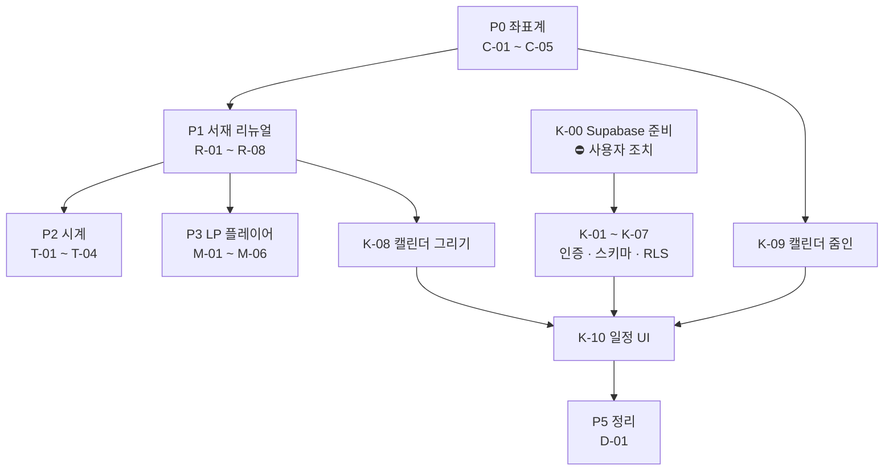

# 06. 서재 리뉴얼 WBS

`05-roadmap.md` 의 스프린트 계획을 이번 리뉴얼 범위로 다시 쪼갠 문서입니다.
작업 단위, 의존 관계, 완료 기준을 정해 두고 순서대로 진행합니다.

---

## 1. 배경

### 왜 리뉴얼인가

**(1) 모바일 배치가 깨져 있습니다 — 설계 결함입니다.**

현재 사물 좌표가 서로 다른 기준을 씁니다.

```
left, width  →  뷰포트 '폭'의 %
top          →  뷰포트 '높이'의 %
```

세로 화면(375×812)에서는 폭이 좁아 물건이 작아지는데 높이는 길어서 위아래로 흩어집니다.
가구(선반·책상)도 각자 다른 기준으로 움직이니 **물건과 가구가 따로 놉니다.**
값을 조정해서 될 문제가 아니라 좌표계를 바꿔야 합니다.

**(2) 방의 성격을 "개인 서재"로 명확히 합니다.**

지금은 물건이 놓인 방일 뿐 "공부하는 사람의 공간"으로 읽히지 않습니다.
책장·책 더미·서류·스탠드를 넣어 현실적인 개인 공간으로 만듭니다.

**(3) 기능 세 가지가 추가됩니다.** 시계 · LP 플레이어 · 캘린더.

### 확정된 결정

| 항목 | 결정 | 근거 |
|---|---|---|
| 분위기 | **차분하고 사실적인 서재** | 나무·종이·황동빛 중심. 색을 가라앉히고 디테일을 늘림 |
| 캘린더 공개 범위 | **나만 보는 비공개** | 진짜 일정관리. → Supabase + Auth + RLS 필요 |
| 음악 재생 | **유튜브 임베드 목록** | 대역폭 0, 곡 교체가 쉬움 |
| 밤/낮 토글 | **유지** | 기존 자산을 살림 |

### 유튜브 임베드로 감수하는 것 (재논의 방지용 기록)

- **광고를 막을 수 없습니다.** 영상 주인의 수익화 설정이 정하며 우리가 통제 못 합니다
- **프리미엄은 사이트가 아니라 보는 사람에게 붙습니다.** 운영자 계정과 무관합니다
- 영상이 삭제·비공개되면 그 항목이 깨집니다 → 주기 점검 필요
- iframe 이라 플레이어 디자인을 서재 톤에 맞출 수 없습니다
- 광고가 실제로 거슬리면 그때 음원 파일 직접 호스팅으로 전환합니다 (M-05 참조)

---

## 2. 순서를 정하는 기준

1. **다른 작업의 좌표를 바꾸는 것이 먼저.**
   좌표계를 나중에 고치면 시계·LP·캘린더를 두 번 배치해야 합니다.
2. **막히는 것은 일찍 드러낸다.**
   캘린더는 인프라(Supabase)가 필요하고 그건 사용자 조치가 필요합니다.
   지금 알려서 병렬로 풀 수 있게 합니다.
3. **눈에 보이는 것을 먼저.**
   서재 리뉴얼이 끝나면 나머지는 그 위에 얹는 일이라 중간 확인이 쉬워집니다.
4. **작고 독립적인 것은 사이에 끼운다.** 시계가 그렇습니다.

---

## 3. 작업 분해

크기 표기: **S** 작음 · **M** 보통 · **L** 큼

### P0 — 좌표계 (모든 것의 토대)

| ID | 작업 | 크기 | 의존 |
|---|---|---|---|
| C-01 | 고정 비율 무대(artboard) 도입. 방을 1600×900 좌표계 안에 그림 | M | — |
| C-02 | 무대를 뷰포트에 맞춰 확대·축소(cover)하고 중앙 정렬 | S | C-01 |
| C-03 | 세로 화면 대응 — 좌우가 잘리므로 안전 영역 정의 | M | C-02 |
| C-04 | 모든 사물·가구 좌표를 무대 좌표(px)로 이전 | M | C-01 |
| C-05 | 카메라 계산을 무대 좌표 기준으로 수정 | S | C-04 |

**완료 기준**
- [ ] 데스크톱(16:9)·노트북(16:10)·아이패드(4:3)·아이폰(19.5:9)에서 **물건이 전부 가구 위에** 놓여 있음
- [ ] 창을 극단적으로 늘리거나 줄여도 물건이 가구에서 떨어지지 않음
- [ ] 세로 화면에서 중요한 물건이 잘려나가지 않음
- [ ] 카메라 줌인 시 대상이 화면 지정 위치에 정확히 옴 (PC/모바일 각각)

> **왜 이게 1번인가**: 이걸 안 하면 시계를 책상에 올리고, 나중에 좌표계를 바꾸고,
> 시계를 다시 올려야 합니다. LP·캘린더도 마찬가지입니다. 네 번 할 일을 한 번으로 만듭니다.

---

### P1 — 서재 리뉴얼

| ID | 작업 | 크기 | 의존 |
|---|---|---|---|
| R-01 | 색 팔레트 재조정 — 채도를 낮추고 나무·종이·황동 계열로 | S | — |
| R-02 | **책장** 신규 — 벽면 한쪽을 채우는 책장과 꽂힌 책들 | L | C-01 |
| R-03 | 책상 확장 — 상판을 넓히고 서랍·다리 구조를 사실적으로 | M | C-01 |
| R-04 | 책상 위 소품 보강 — 노트·서류철·필통·안경·스탠드 | M | R-03 |
| R-05 | 바닥·벽 질감 — 마루결, 벽지, 걸레받이 정리 | S | — |
| R-06 | 조명 재설계 — 창빛 + 스탠드 빛의 두 광원, 그림자 방향 통일 | M | R-01 |
| R-07 | 기존 사물 12종을 새 톤에 맞게 재도색 | M | R-01 |
| R-08 | 밤 모드를 새 팔레트에 맞춰 재조정 | S | R-06 |

**완료 기준**
- [ ] "사람이 실제로 공부하는 방"으로 읽힘 — 물건이 떠 있지 않고 놓여 있음
- [ ] 광원이 두 개(창·스탠드)이고 그림자 방향이 전부 일관됨
- [ ] 낮/밤 모두 색이 무너지지 않음
- [ ] 이미지 파일 추가 없이 CSS/SVG 로만 (`docs/04` 이미지 전략 유지)

---

### P2 — 책상 시계

| ID | 작업 | 크기 | 의존 |
|---|---|---|---|
| T-01 | 책상용 탁상시계 그리기 (벽시계와 별개) | S | R-03 |
| T-02 | KST 실시간 시:분:초 동작 | S | T-01 |
| T-03 | 서버/클라이언트 시간 불일치 처리 (하이드레이션) | S | T-02 |
| T-04 | 초침이 보이도록 확대 시 가독성 확보 | S | T-02 |

**완료 기준**
- [ ] 실제 KST 와 초 단위까지 일치 (시스템 시간대와 무관하게 항상 KST)
- [ ] 하이드레이션 경고 없음
- [ ] 탭을 오래 열어두거나 절전 후 복귀해도 시간이 어긋나지 않음
- [ ] `prefers-reduced-motion` 에서도 시간은 갱신됨 (초침 애니메이션만 생략)

> 시계는 다른 작업과 얽히지 않아 중간에 끼우기 좋습니다.
> 서버에서 렌더링한 시각과 브라우저 시각이 달라 하이드레이션 경고가 나기 쉬운 것만 주의합니다.

---

### P3 — LP 플레이어

| ID | 작업 | 크기 | 의존 |
|---|---|---|---|
| M-01 | LP 판 + 턴테이블 그리기, 책상 위 배치 | M | R-03 |
| M-02 | 재생목록 데이터 구조 (`content/playlist.ts`) | S | — |
| M-03 | 클릭 → 곡 목록 패널 (기존 카드 방식 재사용) | M | M-02 |
| M-04 | 유튜브 IFrame API 연결, 재생/정지/다음 | M | M-03 |
| M-05 | 재생 중 상태 표시 — 판이 도는 표시, 항상 보이는 정지 버튼 | S | M-04 |
| M-06 | 자동재생 금지 · 소리 상태 기억(localStorage) | S | M-04 |

**완료 기준**
- [ ] **어떤 경우에도 자동 재생되지 않음** — 반드시 사용자가 눌러야 소리가 남
- [ ] 정지 버튼이 재생 중 항상 화면에 보임
- [ ] 다른 화면(갤러리·캘린더)으로 이동해도 재생이 끊기지 않음
- [ ] 영상이 삭제된 항목은 오류 없이 건너뜀
- [ ] 모바일에서 동작 (iOS 는 사용자 제스처 없이는 소리가 안 납니다 — 클릭으로 시작하므로 충족)

> **채용 담당자는 사무실에서 소리를 켜고 봅니다.** 자동재생은 도움이 아니라 피해입니다.
> 이 원칙은 구현 편의보다 우선합니다.

---

### P4 — 캘린더 (인프라 필요)

비공개 일정이므로 **로그인과 DB 가 필요합니다.** `docs/02` · `docs/03` 의 설계를 여기서 처음 실제로 적용합니다.

| ID | 작업 | 크기 | 의존 | 비고 |
|---|---|---|---|---|
| **K-00** | **Supabase 프로젝트 준비** | S | — | ⛔ **사용자 조치 필요** |
| K-01 | Supabase 클라이언트 3종 + 환경변수 | S | K-00 | `docs/03` §4.2 |
| K-02 | 관리자 계정 생성 + `app_metadata.role=admin` + 가입 비활성화 | S | K-00 | `docs/03` §4.5 |
| K-03 | `events` 테이블 스키마 + 제약 | S | K-01 | |
| K-04 | RLS 정책 — **본인만 읽기·쓰기** | M | K-03 | `docs/02` §5 |
| K-05 | 명시적 GRANT (2026-05-30 이후 프로젝트) | S | K-03 | `docs/02` §5.3 |
| K-06 | 타입 생성 파이프라인 | S | K-03 | `docs/02` §9 |
| K-07 | 로그인 화면 + 미들웨어 (`/admin` 한정) | M | K-02 | `docs/03` §4.3 |
| K-08 | 벽걸이 캘린더 그리기 + 배치 | M | R-02 | |
| K-09 | 캘린더 줌인 화면 (모니터와 같은 방식) | M | K-08, C-05 | |
| K-10 | 월 보기 · 일정 추가/수정/삭제 UI | L | K-09 | |
| K-11 | 로그인 안 한 방문자에게 보이는 화면 | S | K-07 | 일정 대신 안내 |

**완료 기준**
- [ ] **로그아웃 상태에서 익명 키로 `events` 를 직접 조회 → 0건** ← 가장 중요
- [ ] 로그인 후 일정 추가·수정·삭제가 되고 새로고침해도 남아 있음
- [ ] 캘린더 줌인/줌아웃이 모니터와 같은 감각으로 동작
- [ ] 방문자에게는 일정 내용이 어떤 경로로도 노출되지 않음
- [ ] `robots` 에서 `/admin` 차단

> **왜 마지막인가**: 인프라 준비(K-00)가 사용자 조치를 기다려야 하고,
> 캘린더 배치(K-08)가 책장 위치(R-02)에 의존하며,
> 줌인(K-09)이 새 좌표계(C-05)에 의존합니다. 앞이 다 끝나야 깨끗하게 붙습니다.

---

### P5 — 정리

| ID | 작업 | 크기 | 의존 |
|---|---|---|---|
| D-01 | `docs/02`·`03`·`05` 를 실제 구현에 맞게 갱신 | M | P4 |
| D-02 | 실제 저장소 목록으로 `projects.ts` 교체 | M | — |
| D-03 | 실제 이력으로 `resume.ts` 교체 | S | — |
| D-04 | `robots` 색인 열기 | S | D-02, D-03 |

> D-02 · D-03 은 다른 작업과 무관하므로 **언제든 끼워 넣을 수 있습니다.**
> 실제 자료가 준비되는 대로 알려주시면 그때 처리합니다.

---

## 4. 의존 관계



**병렬로 가능한 것**
- K-00 (Supabase 준비)은 **지금 당장** 시작할 수 있습니다. P0~P3 와 무관합니다
- D-02 · D-03 (실제 콘텐츠)도 언제든 가능합니다

---

## 5. 지금 막혀 있는 것

| # | 막힌 것 | 필요한 조치 | 누가 |
|---|---|---|---|
| 1 | **K-00 Supabase** | Docker Desktop 설치 **또는** 원격 프로젝트 생성 | 사용자 |
| 2 | **M-02 재생목록** | 넣고 싶은 유튜브 영상/재생목록 주소 | 사용자 |
| 3 | D-02 프로젝트 | 실제 저장소 10~15개 주소 | 사용자 |
| 4 | D-03 이력서 | 실명·회사·학력·자격증 | 사용자 |

**1번은 지금 시작하시는 게 좋습니다.** P0~P3 를 진행하는 동안 병렬로 풀리면
캘린더에 도달했을 때 기다리지 않습니다.

---

## 6. 리스크

| 리스크 | 영향 | 대응 |
|---|---|---|
| **세로 화면에서 서재가 답답해짐** | 높음 | C-03 에서 안전 영역을 정하고, 실기기로 확인한 뒤 다음 단계 진행 |
| 책장·책 SVG 가 무거워짐 | 중간 | 책은 반복 패턴으로 그리고 개별 도형 수를 제한. 초기 HTML 크기를 측정하며 진행 |
| 유튜브 영상 삭제 | 중간 | 오류 시 조용히 건너뛰고, 분기별 점검을 운영 체크리스트에 추가 |
| 캘린더 RLS 실수로 일정 노출 | **매우 높음** | K-04 완료 기준의 익명 조회 테스트를 반드시 수행. 통과 전에는 실제 일정 입력 금지 |
| 카메라 대상이 늘어 조작이 헷갈림 | 중간 | 줌인 대상은 모니터·캘린더 둘로 한정. 나머지는 카드로 처리 |
| 작업 중 배포가 깨짐 | 낮음 | 각 P 단위로 빌드 확인 후 푸시. 라우트 표가 Static/SSG 인지 매번 확인 |

---

## 7. 진행 방식

- **P 단위로 끊어서 푸시**합니다. 각 P 가 끝나면 배포하고 확인받은 뒤 다음으로 갑니다
- 각 P 완료 시 **완료 기준 체크리스트를 실제로 확인**하고 결과를 보고합니다
- 중간에 방향을 바꾸고 싶으면 P 경계에서 바꾸는 것이 가장 쌉니다

---

## 8. 결정이 필요한 항목

- **Q1. P0 → P1 → P2 → P3 → P4 순서로 갈까요?**
  다른 순서를 원하시면 말씀해 주세요. 다만 P0 를 먼저 하는 것은 바꾸지 않는 편이 좋습니다.

- **Q2. 세로 화면(휴대폰)에서 서재를 어떻게 보여줄까요?** — C-03 에서 정해야 합니다
  (a) 좌우를 잘라 중앙만 보여주기 — 방 느낌 유지, 대신 가장자리 물건이 안 보임
  (b) 방 전체를 축소해 위아래 여백 — 다 보이지만 물건이 작아짐
  (c) 세로 전용 배치를 따로 만들기 — 가장 좋지만 배치를 두 벌 관리
  실기기로 (a)/(b) 를 비교한 뒤 정하는 것을 권합니다.

- **Q3. 벽시계와 탁상시계를 둘 다 둘까요?**
  지금 벽시계는 10시 10분에 멈춰 있는 장식입니다.
  둘 다 실시간으로 돌리면 시선이 분산되니, **탁상시계만 실시간**으로 하고
  벽시계는 없애거나 장식으로 두는 것을 권합니다.

- **Q4. 캘린더는 관리자 전용인데, 방문자에게는 무엇을 보여줄까요?**
  (a) 캘린더를 아예 안 보이게
  (b) 벽에 걸려 있되 누르면 "관리자 전용" 안내
  (c) 공개용 정보만 표시 (면접 가능 시간대 등)
  권고는 (b) 입니다 — 장면의 일부로 남으면서 정직합니다.
